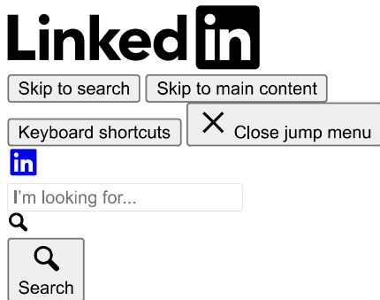

.

ome

My Network

bs

...

Messaging

●23 23 new notifications

●

●

●

Advvertise

 Sandra Pellumbi in

 Co-Founder\& CEO| Founders are the most important person in their business and the most exhausted. I fix the second one-without a full-time hire| Part-time AI-trained EAs+ operational infrastructure  $\downarrow$  Free audit

 Follow Message

 All activity

 Posts Comments Videos Images More▼

Loaded 280 Posts posts

• Feed post number 1

$$\text{ndra Pellumbi in}\cdot 3rd+Co-\text{Founder\& CEO}|\text{Founders are the most important person in their}b$$$$\text{. I fix the second one-without}$$a full-time hire| Part-time AI-trained EAs+ operational infrastructure↓ Free audit

 Visit my website

11h•

It's a Thursday morning and you open your laptop without dread.

No backlog pulling at you.

No mental list of things only you can handle.

No low-grade guilt about the thing you didn't get to yesterday.

Just your coffee.

Your actual work.

The stuff you started this business to do.

That version of your Thursday exists.

You just can't see it yet because right now you're too deep in the other one.

The one where:

1/ You're technically fine. Revenue holding. Just... managing.

2/ Your tolerance has shrunk. Faster to react, slower to recover.

3/ You've stopped thinking ahead. The 90-day vision lives in a doc you haven't opened.

4/ You're the last line of everything. Every decision waits on you.

5/ Rest doesn't reset you. Good weekend. Still tired Monday.

6/ Your best work has narrowed. Big-picture thinking now costs what it never used to.

7/ You've normalized the load."This is just how it is" replaced"this needs to change."

8/ You've pulled back socially. Briefer. Quieter. Conserving.

9/ You know something has to change. You've thought it in the shower. The car. At 11pm.

Quiet burnout doesn't announce itself.

It just slowly becomes the background noise of your whole business.

The exit isn't a better morning routine.

It isn't a vacation.

It isn't a mindset shift.

It's building a structure where the business stops needing you to initiate everything.

Where decisions move without you in the middle.

Where Thursday morning actually feels like Thursday morning again.

The cheatsheet maps all 9 in detail. Save it.

P.S. What would your first dread-free Thursday actually look like?

If this resonated, repost it.

Follow Sandra Pellumbi for posts on founder operations, AI leverage, and getting your time back.

You just recognized yourself in at least 3 of those signs. The Founder Bottleneck  $Audit^{TM}$  tells you exactly which part of your structure is causing it, in 2$$\text{ utes}\rightarrow\text{ https://lnkd.in/dPbU2P-F}$$

Ready to get out of the middle of everything? The Founder Force Multiplier  $OS^{TM}$  pairs you with an AI-trained EA partner who takes the operational load off your plate so you stop being the reason things move or stall.

10 priority access spots open June 8.

Comment"WAITLIST" or hit the link in my bio.

QUiET BURNOUT:9 SIGNS YOU'RE ALREADY IN IT

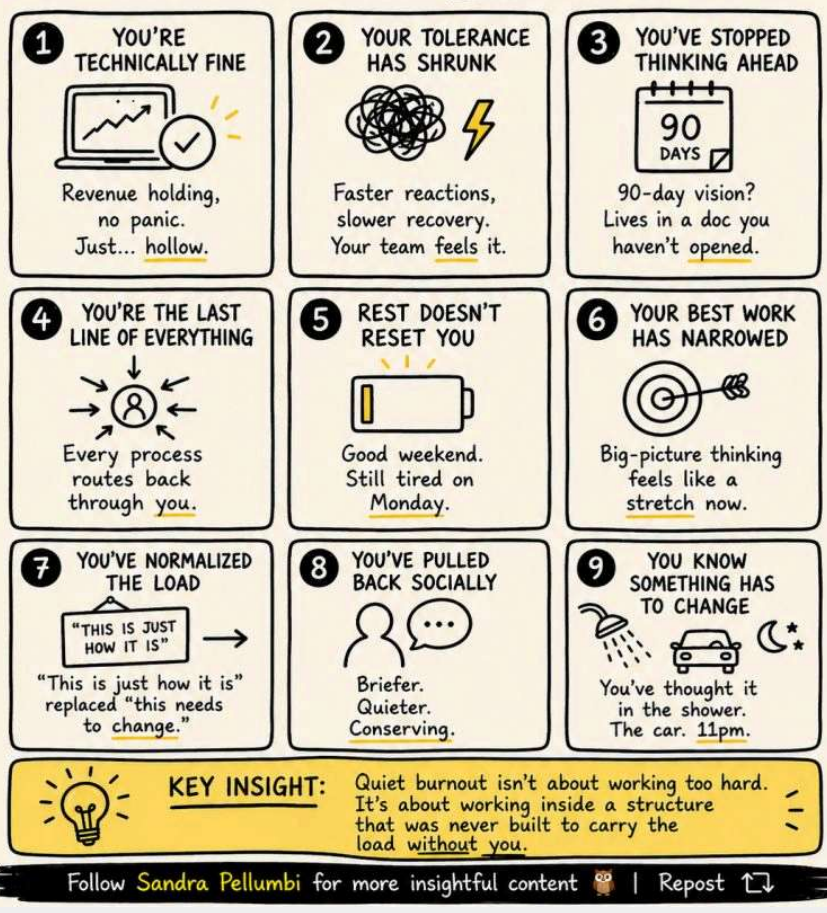

$$\begin{array}{l}\text{。}\quad\text{like}\quad\text{insightful}\quad\text{love}\quad 191\\ \text{。}\quad\text{124 comments}\\ \text{■}\quad\text{10 reposts}\\ \end{array}$$

. Feed post number 2

Sandra Pellumbi in  $\cdot$  3rd+ Co-Founder\& CEO| Founders are the most important person without a full-time hire| Part-time AI-trained EAs+ operational infrastructure  $\downarrow$  Free audit Visit my website

1d.

$$\cdots\$$

An agency added$133,752 in new ARR in 30 days...

No new hires.

No new service line.

Looking at the result, you'd assume they found a new growth play.

There wasn't.

The bottleneck wasn't strategy.

It was an execution capacity.

The team already knew what needed to happen.

The problem was nobody had enough bandwidth to consistently do the work.

That's what makes this Viktor case study interesting.

Instead of adding headcount, they added an AI employee inside their workflow.

The result wasn't better ideas.

The result was more execution.

I think that's where this entire category is heading.

The gap between companies that know what to do and companies that actually get it done is growing.

Most AI gives advice.

The interesting products are starting to do the work.

Get started free at viktor.com.$100 in credits included, no card required. Link in the comments.

viktor.com

 hashtag#AI hashtag#Alemployee hashtag#Leadership

$$\text{Your document has finished loading}$$

Viktor_ARR_Growth_Case_Study.pdf•7

pages 7 pages

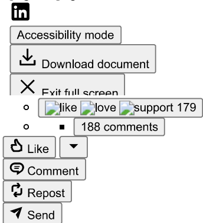

• Feed post number 3

 Sandra Pellumbi in  $\cdot 3 rd+\infty$  Co-Founder\& CEO| Founders are the most important person in their business and the most exhausted. I fix the second one-withouta full-time hire| Part-time AI-trained EAs+ operational infrastructure↓ Free audit website

2d.

The day before the breakthrough, it looks identical to the day before the quit:

Nobody tells you that part.

Reid Hoffman launched LinkedIn at 36 after his first company flopped.

Colonel Sanders was 65, driving to franchises in a beat-up car, sleeping in the back seat, when KFC finally said yes.

Julia Child published her first cookbook at 49. Before that, she was a government spy and a copywriter.

Soichiro Honda was turned down by Toyota for an engineering job. He started building motorcycles in his garage. You know the rest.

J.K. Rowling was a single mother on welfare, clinically depressed, writing in a café because her apartment was too cold. Twelve publishers rejected Harry Potter.

The pattern isn't talent. The pattern isn't timing.

It's that every single one of them stayed in motion during the period that looked like nothing.

The world calls it an overnight success.

The person living it calls it Tuesday.

Your current chapter is not your final chapter.

Build like you know that.

P.S. What's the one thing you're still building through right now even when it feels invisible?

Activate to view larger image,

You can be:

lost at 22

broke at 28

unsure at 31

start over at 35

glow and rise at 38

find your purpose at 42

become truly unstoppable at 47

Trust the process.

You're not behind.

You're still becoming.

Greatness is never rushed.

Activate to view larger image,

o like love support 1,297$$\begin{align*}&\text{o}\\ &\text{o}\\ &\end{align*}$$■238 comments 96 reposts

 Like▼Comment

 Repost

1 Send

. Feed post number 4

 Sandra Pellumbi in  $\cdot$  3rd+ Co-Founder\& CEO| Founders are the most important person without a full-time hire| Part-time AI-trained EAs+ operational infrastructure  $\downarrow$  Free audit Visit my website

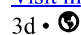

You opened your laptop this morning with a plan.

By 11am, half the day was already spent on things that had nothing to do with that plan.

→Emails that needed replies.

 $\rightarrow$  A scheduling thread that turned into five messages.

 $\rightarrow$  A follow-up someone dropped that only you knew to catch.

You did the work.

The business moved forward.

And somehow you still feel behind.

That's the energy audit in real time.

The hours aren't disappearing to laziness or poor focus.

They're being consumed by a structure that was never designed to run without you in the middle of it.

This cheatsheet maps the four drains pulling from the same cognitive fuel you need for the work that actually grows the business.

Execution, Knowledge, Decision, Growth.

Each one quiet.

Each one expensive.

The self-audit question at the bottom will show you exactly where yours is.

P.S. If you tracked every task you touched today, how many of them actually needed to be initiated by you?

If this resonated, repost it. Someone in your network needed to read this today.

+ Follow Sandra Pellumbi for posts on founder operations, AI leverage, and getting your time back.

If you want to know exactly which zone is driving your load, the Founder Bottleneck Audit  ${}^{TM}$  pinpoints it in 2 minutes  $\rightarrow$  https://lnkd.in/dPbU2P-F

Ready to see the full solution?

founding partner spots open June 8.

Comment"WAITLIST" or hit the link in my bio.

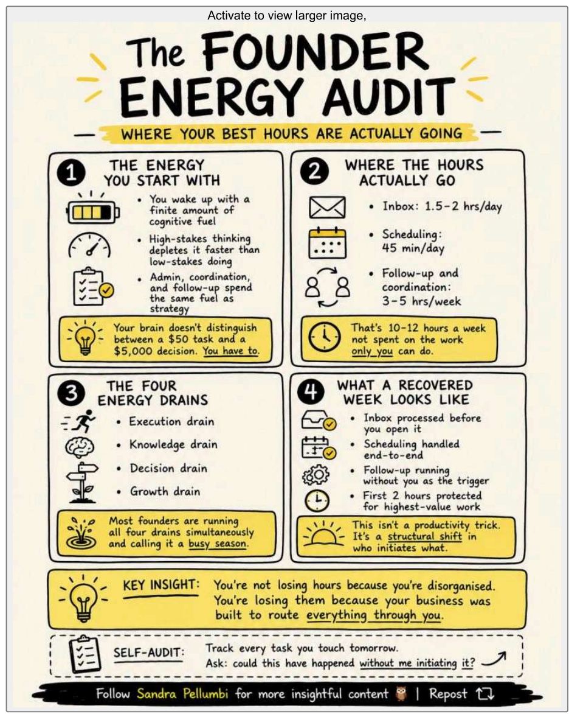

Activate to view larger image,

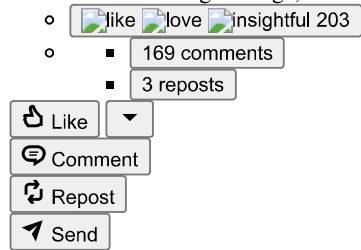

• Feed post number 5

Sandra Pellumbi in  $\cdot$  3rdCo-Founder\& CEO| Founders are the most fix$$\text{ fix the second one-without}$$a full-time hire| Part-time AI-trained EAs+ operational infrastructure↓ Free audit website

6d.

...

When your best people go quiet... it's already too late.

They didn't decide to leave that day.

They decided weeks earlier.

You just didn't catch it.

It starts so small you almost miss it.

 $\rightarrow$  The one who used to push back in meetings, stops pushing.

 $\rightarrow$  The one who sent you ideas on Sunday, stops sending.

→The one who cared too loudly, goes carefully, deliberately silent.

Quiet isn't peace.

In high-performers, quiet is the sound of someone deciding it's no longer worth it.

And the cruel part?

By the time you notice, the version of them that believed in what you were building is already gone.

Culture doesn't break in a single moment.

It erodes.

Slowly.

Quietly.

→Through the manager who never acknowledges a win.

→The feedback session that leads nowhere.

→The toxic teammate everyone can see and no one will address.

→The values on the wall that don't show up in the room.

10 signs your culture is already cracking:

1/ Values are framed on the wall not practiced in the hallway

2/ Purpose is announced, never felt

3/ Feedback is collected, then filed away

4/ Poor behavior gets quietly"managed around"

5/ You hire for skills and ignore the energy someone brings in

6/ Culture gets cut the moment budgets tighten

7/ Team-building gets labeled a"nice to have"

8/ Perks replace belonging

9/ Culture is manufactured, not grown

10/ Surveys are run. Results are ignored. Repeat.

5 things that actually change it:

1. Check in-don't check on.

"How are you doing?" lands differently than"Where are you on that?"

2. Listen to absorb, not to reply.

Feedback from your team is information. Treat it that way.

3. Recognize publicly. Correct privately.

Public praise builds safety. Private correction preserves dignity.

4. Learn to read the early signals.

Silence. Shorter answers. Doing just enough.

These aren't attitude problems. They're data.

5. Make trust a daily practice, not an annual initiative.

You build it in the small moments. You destroy it the same way.

Your people don't want a job description.

They want to walk in the door and feel like it matters that they showed up.

Culture isn't a program you launch.

It's the pattern your people experience every single day especially when no one senior is watching.

P.S. What's one subtle shift you've noticed right before someone great starts to pull away?

When your best people go silent, it's not disengagement.It's defeat.

The workplace turned toxic and leadership stopped listening.

SANDRA PELLUMBI Follow for more.

Activate to view larger image,

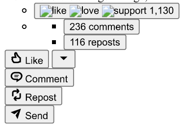

. Feed post number 6

Sandra Pellumbi in· 3rd+ Co-Founder& CEO| Founders are the most important person in their business and the most exhausted. I fix the second one-without a full-time hire| Part-time Al-trained EAs+ operational_Free audit website

Nobody asks founders what they're carrying between the work.

The conversations they're pre-writing.The cash position ticking in the background.The hire they keep avoiding.

The version of the business they can see but can't reach from inside this week.

This cheatsheet maps all of it:six categories of invisible cognitive load that run 24/7 in every founder-led business.

No to-do list captures this.No time audit catches it.

It just accumulates.

The founders I work with are rarely short on capability.

They're short on cognitive space.

There's a difference, and it matters.

P.S. Which of these six tabs costs you the most right now? Drop it in the comments.

If this resonated, repost it. Someone in your network needed to read this today.

Follow Sandra Pellumbi for posts on founder operations, AI leverage, and getting your time back.

If you want to know exactly which zone is driving your load, the Founder Bottleneck  $Audit^{TM}$  pinpoints it in 2 minutes  $\rightarrow$   $\underline{\text{https://lnkd.in/dPbU2P-F}}$ 

Already ready for the full solution?e Founder Force Multiplier  $OS^{TM}$  pairs you with an AI-trained EA partner built around your business, so the daily operational load stops living in your head.

10 priority access spots open June 8.

Comment"WAITLIST" or hit the link in my bio.

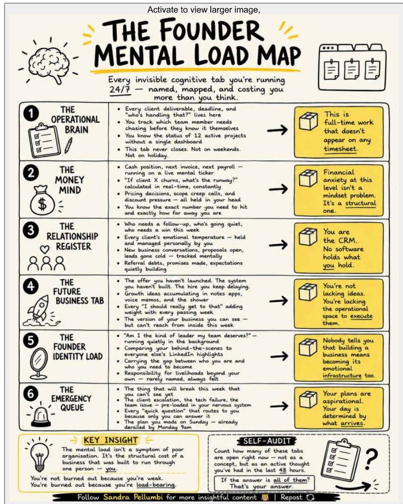

Activate to view larger image,

• Feed post number 7

$$\text{ Pellumbi in}\cdot 3rd+\frac{\infty}{\infty}\text{ Co-Founder\& CEO}|\text{ Founders are the most}$$cond one-without a full-time hire| Part-time AI-trained EAs+ operational infrastructure↓ Free audit website

 lw.

[...

10 founders. 10-15 hours a week reclaimed. One infrastructure decision.

Replying to a client email and closing a$5K deal in the same afternoon is not productivity.

It's a structural problem.

Most founders doing$10K-$60K+ a month are running two jobs simultaneously.

 $\rightarrow$  The work that grows the business.

 $\rightarrow$  And the work that just keeps it running.

Both land on the same calendar, in the same hour, with the same level of urgency.

The cheatsheet above breaks down exactly what AI handles best and what only a human EA can do.

The fix isn't working harder or getting better at switching contexts.

It's building the infrastructure that means the low-value work stops reaching you at all.

The dream outcome is not complicated:

You work on the business.

Your EA manages the operational layer.AI removes the volume.

Nothing breaks when you step away.

You finish a week and can point to exactly what moved forward.

The founders who get here don't work less.

They just stop doing work that was never theirs.

10 spots. June 8. Comment"WAITLIST" or visit the link in my bio to see everything inside.

If this resonated, repost it. Someone in your network needed to read this today.

Follow Sandra Pellumbi for posts on founder operations, AI leverage, and getting your time back.

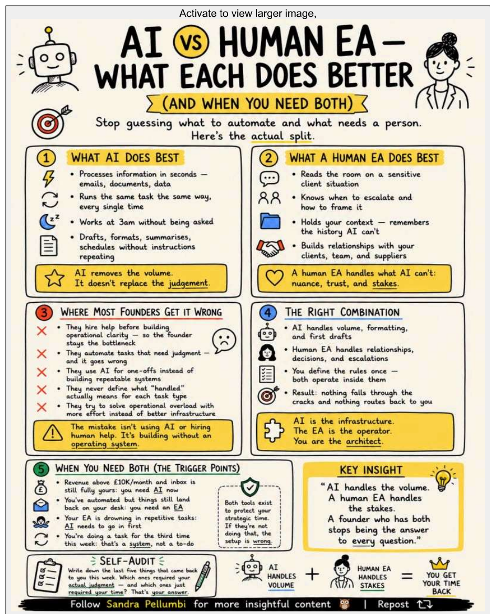

Activate to view larger image,

$$\begin{array}{l}\text{ Like}\\ \text{ Comment}\\ \text{ Repost}\\ \text{ Send}\\ \end{array}$$

. Feed post number 8

Sandra Pellumbi in  $\cdot 3$  rd+ Co-Founder\& CEO| Founders are the most important person in their business and the most exhausted. I fix the second one-without a full-time hire| Part-time AI-trained EAs+ operational infrastructure Free audit Visit my website

1w•

One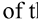the biggest lies founders tell themselves is:

“It only takes 2 minutes.”

2 minutes checking Slack.

2 minutes replying to a client.

2 minutes fixing the calendar.

2 minutes reviewing something your team“just needs quickly.”

And suddenly your entire brain is scattered.

Your attention never fully came back afterward.

Most founder burnout isn't coming from big problems.

It comes from constant tiny interruptions all day long.

That feeling where:

you worked the entire day..

but somehow the important work still didn't happen?

That's usually not laziness.

Not lack of discipline.

Not even bad time management.

It's operational dependency.

Too many things still require you.

Too many decisions still route through you.

Too much context still lives in your head.

A lot of founders don't need more productivity hacks.

They need:

→fewer interruptions

→clearer operational ownership

→better systems

→stronger support

→more protected thinking time

 Because at a certain stage, the bottleneck stops being skill.

It becomes attention.

And if your attention is fragmented all day, scaling starts getting very expensive mentally.

P.S. What's the biggest“small thing” currently stealing your attention every day?

Follow me Sandra Pellumbi for posts on founder operational leverage, AI systems, and building the infrastructure that gets you out of the bottleneck.

Most founders don't realize where the real bottleneck actually is until they map what still depends on them.

That's why I built the 2-minute Founder Bottleneck Audit

 Take it here: https://lnkd.in/dPbU2P-F

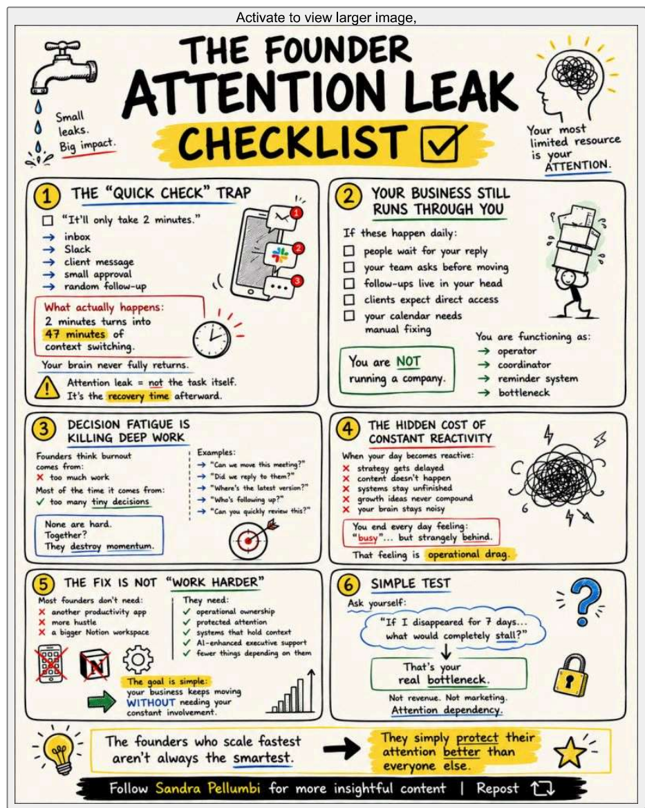

Activate to view larger image,

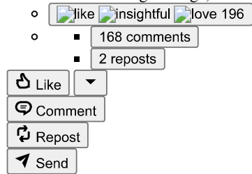

• Feed post number 9

Sandra Pellumbi in  $\cdot$  3rd+ Co-Founder\& CEO  $|$  Founders are the most$$\text{econd one-without}$$a full-time hire| Part-time AI-trained EAs+ operational infrastructure↓ Free audit Visit my website

1w•

...

Your business can only move as fast as you can.

Most founders don't notice when that becomes the problem.

Not at first.

At first it just looks like a busy week.

Then a busy month.

Then a year where you kept meaning to step back and didn't.

The messages still route through you because you respond faster.

The decisions land with you because context lives in your head and nowhere else.

The client calls still need you because trust was built with you personally, and it hasn't transferred.

Nobody designed this.

It just compounded, quietly, one reasonable choice at a time.

You hired people. It helped for about three weeks.

→Then the questions started.

→Then the escalations.

→Then you realised they needed you to explain everything before they could do anything.

So you explained.

And approved.

And checked.

And re-explained.

And somehow you ended the week more tired than when you worked alone.

You're not the problem. You're the load-bearing wall.

And nobody told you that's what you'd become.

There is a version of this that looks different. Where your involvement is a choice, not a requirement.

Where the people around you have what they need to act without asking first.

That version is built. Not wished for.

P.S. Which part of your business stops when you stop? Drop it in the comments.

If you want to know exactly where your bottleneck lives, comment"BOTTLENECK" below.

I built a free quick audit that scores it across four zones and gives you a named profile. I'll send it directly.

Repost this for the founder who's been the load-bearing wall longer than they'll admit.

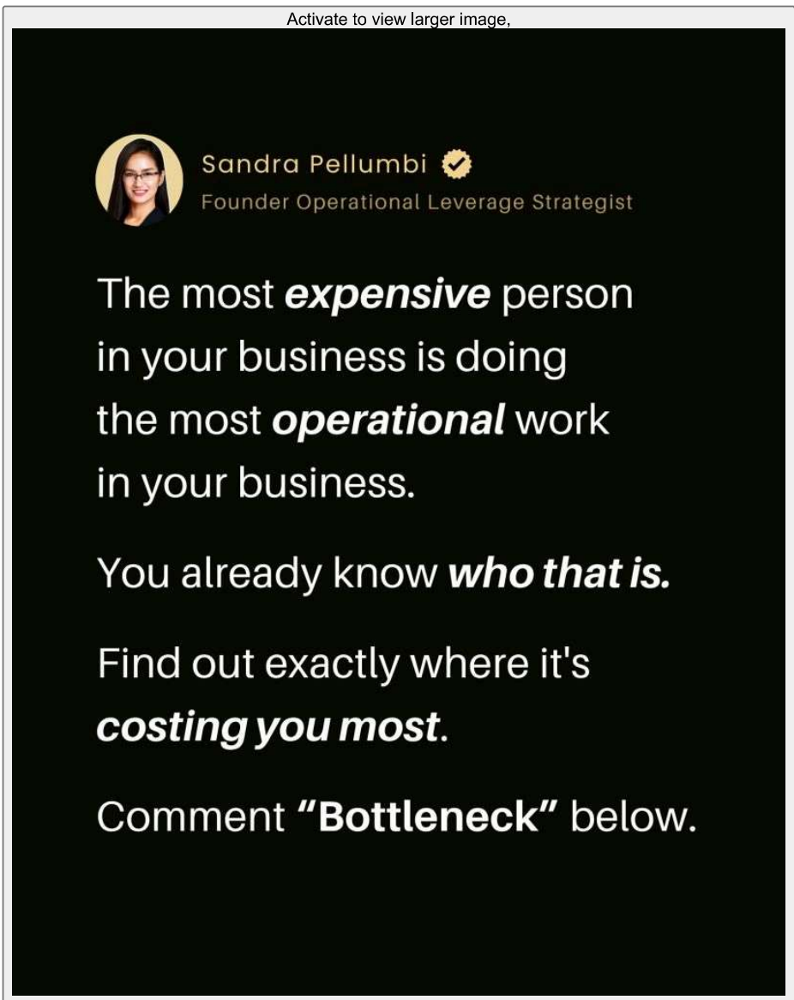

Activate to view larger image,

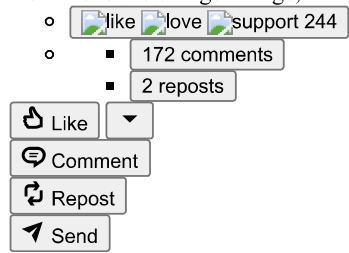

• Feed post number 10

Sandra Pellumbi in  $\cdot 3$  rd+ Co-Founder\& CEO| Founders are the most important person in their business and the most exhausted. I fix the second one-without a full-time hire| Part-time AI-trained EAs+ operational infrastructure↓ Free audit Visit my website

1w.

The Patience Principle: Not everything worth having happens fast.

We want things now.

The job. The deal. The breakthrough.

But here's the truth no one likes hearing:

The faster you chase something, the slower it seems to come.

Because patience isn't passive.

It's preparation.

Most people don't wait long enough to see what could've bloomed.

They:

●Accept“good enough” because it’s available.

.Grab the first offer because it feels safe.

●Tr Trade peace of mind for quick validation

 And later, they look back realizing they mistook urgency for progress.

The people I've seen truly succeed?

They build quiet momentum while others are busy chasing noise.

They protect their pace.

They choose timing over tempo.

They let what's right find them when they're ready.

That's how I've learned to operate too.

No more panic moves.

more shortcuts disguised as solutions.

Just alignment, preparation, and faith that God's timing never misses.

Because the right opportunity never demands you rush.

It requires you to be ready.

The right timing.

The right fit.

The right season.

If you're always chasing what's next,

you might be walking right past what's meant for you.

P.S. Looking back, what's one delay that actually protected or prepared you?

Share this to inspire others.

Follow Sandra Pellumbi for more.

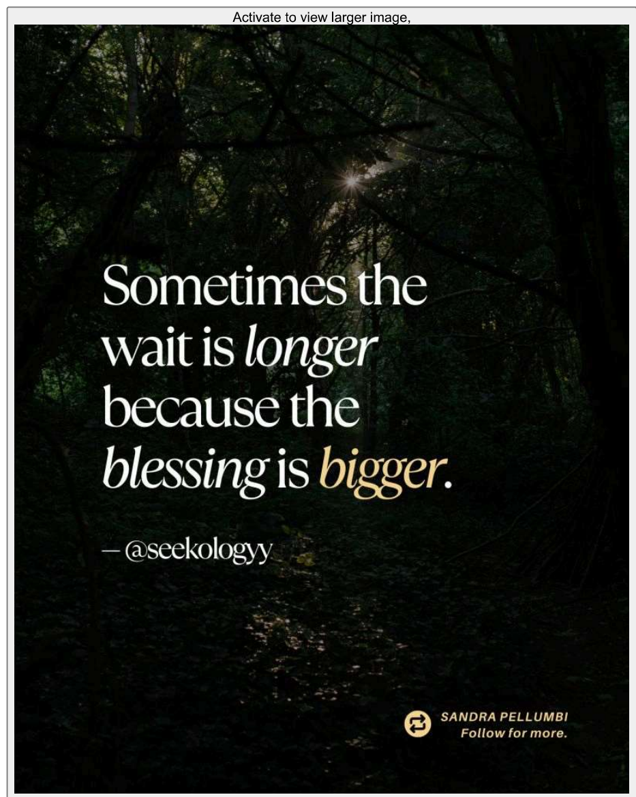

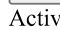Activate to view larger image,

olove support 1,019

$$\begin{align*}&\text{O}\\ &\text{O}\\ &\text{Like}\\ &\text{Comment}\\ &\text{Repost}\\ &\text{Send}\\ &\text{. Feed post number}\,11\end{align*}$$231 comments

■124 reposts

▼

Send

• Feed post number 11

Sandra Pellumbi in  $\cdot$  3rd+ Co-Founder\& CEO| Founders are the most important person in their business and the most exhausted. I fix the second onewithout a full-time hire| Part-time AI-trained EAs+ operational infrastructure| Free audit Free audit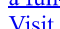Visit my website

2w.Edited

real bottleneck in outbound isn't finding leads anymore.

It's the friction between tools.

LinkedIn.

CRM.

Enrichment.

Sequences.

Tabs everywhere.

Copy-paste madness.

That operational drag compounds FAST.

Been testing the new@la growth machine Chrome Extension beta recently and honestly...

this is the kind of small workflow improvement that quietly saves teams hours every single week.

You find someone on LinkedIn→click once→lead gets pulled into your outbound system.

Checks if they already exist.

Shows CRM activity.

Syncs with HubSpot.

Enriches the lead.

Adds them into workflows.

Without leaving the page.

That may sound minor.

But teams scaling outbound know:

speed+reduced friction=leverage.

The companies winning outbound right now are not necessarily the ones working harder.

They're the ones building smoother systems.

This one's still in beta.

Definitely worth watching.

Worth checking out if you're serious about scaling outbound:

Also, this link currently upgrades the trial from 14 days to a full 1 month!

https://lnkd.in/dvpnEupx

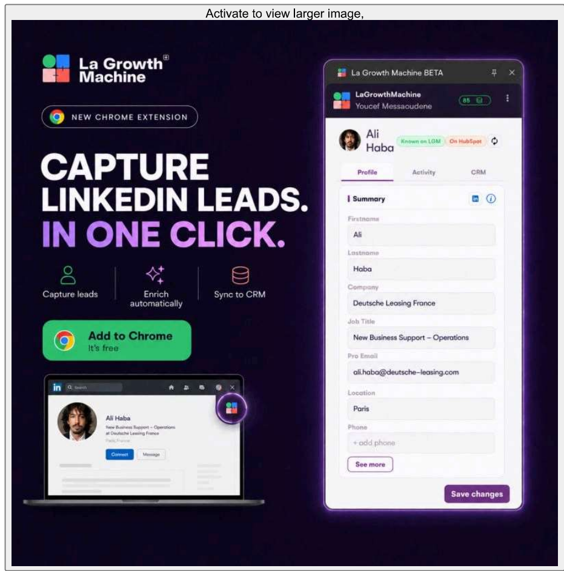

ActivateActivate to view larger image,

$$\begin{array}{l}\text{ like love support 167}\\ \end{array}$$

$$\begin{align*}&\text{O}&&\text{165 comments}\\ &&\text{1 repost}\end{align*}$$

1 repost

Like Comment

. Feed post number 12

 Sandra Pellumbi in.3Co-Founder\& CEOo-Founder\& CEO| Founders are the most important person in their business and the most exhausted. I fix the second one-without a full-time hire| Par$$\text{-Founder\& CEO}|\text{ Founders are the most importa}$$Visit my website

2w•

+ Follow

...

Every founder I speak to says the same thing

"I'm the bottleneck. I just don't know where."

Now there's an audit for that

- Comment"BOTTLENECK"-

And I'll send it straight to your DMs

 Here's what it does:

Scores your business across 4 zones

-Execution, Knowledge, Decision, Growth

 Assigns your exact Bottleneck Profile from 6 named patterns

 Tells you what's actually causing it

 and the 90-day fix.

No fluff. Self-scored in 5 minutes.

The profile reads like someone's been watching your business from the inside.

Because the patterns are that consistent.

Want yours?

- Comment BOTTLENECK-

And I'll send it straight to your DMs

 REPOSTfor the founder who knows something's wrong but can't name it

 P.S. Which profile sounds most like you right now?

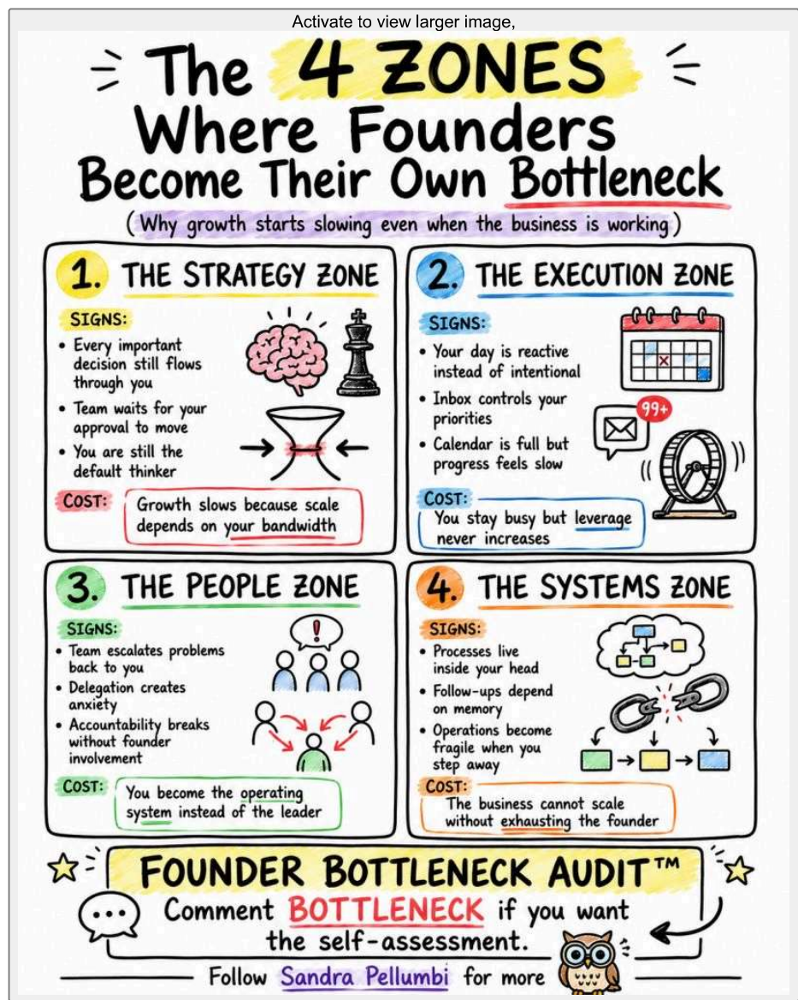

Activate to view larger image,

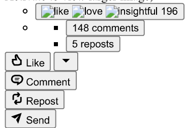

. Feed post number 13

$$\text{ Sandra Pellumbi in}\cdot 3 rd+\infty\text{ Co-Founder\& CEO}|\text{ Founders are the most}$$$$\text{econd one-without}$$a full-time hire| Part-time AI-trained EAs+ operational infrastructure↓ Free audit website

2w.

Harsh truth? Not everyone wants to see you win.

You'll notice it in subtle ways:

The delayed congratulations.

The quiet room when you share a win.

The sudden competition from someone who called you“friend.”

And then

 There are the rare few who celebrate you even when their own season is heavy.

Those are the people who aren't intimidated by your light.

They're fueled by it.

Keep those people close.

Because their energy multiplies yours.

At every level of leadership, your circle is either fuel or fire.

Small minds compete.

Big minds collaborate.

If you want to grow, choose wisely:

Spend time with those who celebrate your progress.

Build with people who want everyone at the table to eat.

Let go of those who only come around when they need something.

Invest in relationships that make you sharper, not smaller.

And most of all, be the person who claps for others first.

Leadership is contagious.

So is envy.

Surround yourself with people who want to see you win.

Added a quick insight for remote professionals in the comments. Worth a read.

P.S. What's one quality you value most in the people you keep close?  $\downarrow$ 

Repost to inspire your network.

Follow Sandra Pellumbi for more.

Surround yourself with people who want to see you win.

Small minds compete.

Big minds collaborate.

SANDRA PELLUMBI Follow for more.

Activate to view larger image,

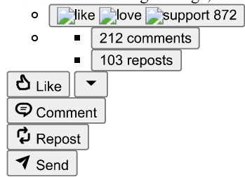

. Feed post number 14

Sandra Pellumbi in· 3rd+ Co-Founder& CEO| Founders are the most important person in their business and the most exhausted. I fix the second one-without a full-time hire| Part-time Al-trained EAs+ operational_Free audit Visit my website

2w•

$$\cdots$$

Most founders I talk to carry deep shame about this.

"I should be better at delegation."

"I should set better boundaries."

"I should be stronger at saying no."

But here's what's actually happening:

You built a business that works.

Then you became the business.

Not because you're bad at delegation because the operational infrastructure never evolved to exist without you.

Your first hire didn't change this.

Your second hire didn't change this.

Your systems looked good on paper.

But the pattern held:

Everything still needed you.

Every decision still funneled through you.

Every context still lived in your head.

It doesn't always look like answering messages at 11pm.

Sometimes it looks like lying awake running through tomorrow's list.

Sometimes it looks like Sunday anxiety before Monday even starts.

Sometimes it looks like being physically present but mentally still at work.

The common thread?

You never fully leave.

Because the business hasn't learned to run without you yet.

Here's the truth:

You can't be optimized.

But your operations can.

It's not about working smarter or delegating better.

It's about building the operational infrastructure that should have evolved months ago.

Creating the systems and distributed decision-making that let the business run with you instead of through you.

That's what the Founder Force Multiplier OSTM does, it rewires your operational backbone so you can finally step back.

But first, you need to see your actual bottleneck.

The Founder Overload AuditTM maps your exact operational pattern and reveals what's actually fixable.

Comment AUDIT below. I'll send you the Founder Overload AuditM free.

Repost if this is the conversation your founder network needs to have.

Follow Sandra Pellumbi for 4 weeks on founder operational leverage- what it actually takes to build a business that multiplies you instead of draining you.

Activate to view larger image,

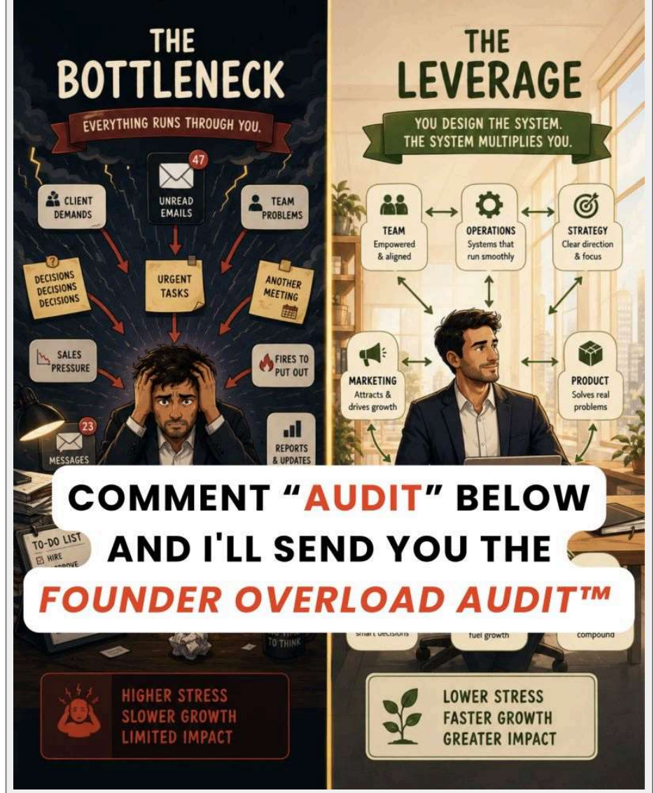

Activate to view larger image,

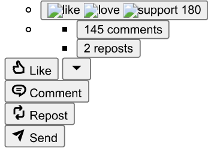

.

• Feed post number 17

Sandra Pellumbi inCo-Founder\& CEO| Founders are the most important person in their business and the most exhausted. I fix the second one-without a full-time hire| Part-time AI-traineds+ operational infrastructure  $\downarrow$  Free audit Visit my website

3w•

+ Follow…

 Build a place people want to stay, not one they want to escape from.

A paycheck might pay you for your time.

But culture, that's what gives that time meaning.

I've seen both.

The job that paid well but felt heavy every morning.

And the one that didn't have all the perks,

yet somehow made you feel alive, trusted, and part of something that mattered.

That's the difference money can't buy.

You can pay people to show up but you can't pay them to care.

That comes from culture

 from how leaders treat people when no one's watching,

how teams speak to each other under pressure,

and how safe someone feels to say,“I need help,” without fear of judgment.

Leaders and professionals at every level this is where your power lies.

Not in titles.

Not in salary budgets.

But in the kind of energy you create around you.

If you want people to stay not out of obligation, but out of pride, start here:

Listen more than you speak.

Recognize effort, not just results.

Stay calm when the pressure rises.

Protect people's peace like it's part of their performance.

Make them feel that their work matters.

Because at the end of the day, most people don't leave companies

 they leave the way they're treated.

P.S. In one word... what does“great culture” mean to you?

Save this if it hit homeRepost inspire better leadership.

Follow Sandra Pellumbi for more.

A good salary motivates you to show up.

A great work culture makes you never want to leave.

SANDRA PELLUMBI Follow for more.

Activate to

$$\begin{align*}&\text{o}\\ &\text{$$

。

.

Like▼

● Feed post number 18

Sandra Pellumbi in· 3rd+Co-Founder& CEO| Founders are the most important person in their business and the most exhausted. I fix the second one-without a full-time hire.| Part-timeFree audit my website

⑤

Follow

 Ad performance rarely comes from a single idea...

It comes from testing multiple directions

 That's where this changes once Uni-1 is used through the API

 Instead of creating ads one by one

 this becomes a step inside a marketing workflow

 I mapped a simple use case

 an ad creative generation layer

inside a campaign pipeline

 What goes into the system:

→product

 $\rightarrow$  audience

→creative angle

 The request is sent to the Uni-1 API

 Uni-1 resolves the direction

 plans composition and tone

 and returns multiple campaign outputs

 What comes back:

different angles

 consistent structure

 ready to test

 This isn't about generating visuals

 It's about generating directions

 With a single API call

 this can be embedded into internal tools

 wired into agency workflows

 or integrated into creative pipelines

→Same input

→multiple outputs

→repeatable and scalable

 That's the shift

 Made with Uni-1

Try Luma Uni-1 API here→https://lumalabs.ai/api

 hashtag#LumaPartner

Your document is loading

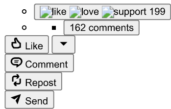

• Feed post number 19

Sandra Pellumbi in  $\cdot 3 rd+\infty$  Co-Founder\& CEO| Founders are the most important person in their business and the most exhausted. I fix the second one-without a full-time hire| Part-time AI-trained EAs+ operational infrastructure↓ Free audit Visit my website

3w.

+ Follow $\cdots$ 

Last night, you closed your laptop...

But your brain stayed open.

→You replayed conversations.

→Remembered a follow-up you forgot.

→Wondered if that proposal was sent.

→Thought about the hire you still haven't made.

You're growing.

Revenue is up.

Opportunities are coming in.

And somehow... it feels heavier than ever.

That's not success.

That's dependency.

Here are 10 CEO-level issues delegation is actually designed to solve:

1/ You're the safety net for everything

 If something slips, it hits you.

Fix: Assign one accountable owner per recurring task.

2/ Your brain is the project manager

 Tasks live in your head, not in a system.

Fix: Centralize everything into one visible task hub.

3/ You attend meetings"just in case"

You don't fully trust the handoff.

Fix: Only attend meetings where you decide or close.

4/ You rewrite work instead of reviewing it

 Redoing feels safer than delegating.

Fix: Create templates and standards before work begins.

5/ You're busy with non-CEO work

 Inbox. Scheduling. Follow-ups. Approvals.

Fix: Install a delegated inbox+ calendar layer.

6/ Strategic work happens after 7pm

 You only think when everyone else stops.

Fix: Protect CEO time weekly. Guard it like revenue.

7/ You delay delegating because it's“faster”

Today's shortcut becomes tomorrow's ceiling.

Fix: Document once. Delegate forever.

8/ Your team waits for you

Momentum pauses at your approval.

Fix: Define decision rights in writing.

9/ Growth creates stress instead of space

 More revenue=more involvement.

Fix: Pair every growth plan with a delegation plan.

10/ You can't fully disconnect

 Even on vacation, you're monitoring.

Fix: Build redundancy: operator+ oversight system.

Here's what most founders never say out loud:

“I don’t want a bigger business.

I want a lighter one."

Delegation isn't about doing less.

It's about building something that doesn't collapse when you breathe.

The goal was never to become the hardest-working person in the room.

It was to build something that runs without your constant presence.

If this felt familiar...

You're not failing.

You're just overdue for leverage.

Repost this to help your network.

Follow Sandra Pellumbi for more.

If this post felt uncomfortably familiar, this is exactly what Force Multiplier OS  ${}^{TM}$  was built for.

We help founder-led businesses reduce operational overload through:

→AI-trained Executive Assistants

→operational systems\& workflow support

→smarter follow-through& execution continuity

→and an operational layer that removes more from the founder's plate

 Not just assistants.

Operational support designed for modern founder workflows.

We're officially launching next month and opening only 10 client partnerships for the first rollout.

Comment“WAITLIST” and I'll send you the details.

Activate to view larger image,

by Sandra Rellumbi

10 CEO-Level Problems Delegation Actually Solves

1.You're the Safety Net for Everything

 If something slips, it lands on you.That's structural dependency.

Fix: Assign clear owners.Every recurring task needs a name next to it. One accountable person.

4.You Rewrite Work Instead of Reviewing It

You could delegate but you don't want to fix it later. So you redo it. Fix: Set quality standards upfront.Templates+examples beat corrections after the fact.

6.Strategic Work Happens After 7pm

Real thinking only happens when Slack goes quiet.Fix: Block protected CEO time weekly. Non-negotiable.

8. Your Team Waits for You

Momentum stalls when you're unavailable.

Fix:Install decision frameworks. Define what they can decide without you in writing.

2. Your Brain Is the Project Manager

Tasks live in your head instead of a system.Mental storage doesn't scale.

Fix: Move everything into one visible task hub. If it's not tracked, it doesn't exist.

9. Growth Creates Stress Instead of Space

Revenue rises. So does your involvement.Fix:Tie every growth goal to a delegation plan. If capacity doesn't expand,you become the ceiling.

3. You Attend Meetings"Just in Case"

You call it oversight. It's really lack of trust in handoffs.

Fix: Define meeting roles.If you're not deciding or closing, you don't attend.

5. You're Busy With Non-CEO Work

Scheduling. Follow-ups.Admin approvals. Inbox triage.Fix:A delegated inbox+calendar layer reclaims strategic hours immediately.

7. You Delay Delegating Because It's"Faster"

Doing it yourself saves 10 minutes today and costs scale long-term.Fix: Document once.Delegate forever.

10. You Can't Fully Disconnect

Even on vacation, you're"just checking in."Fix: Build redundancy.Two layers: operator+ oversight system.

FIND THIS VALUABLE? FOLLOW SANDRA PELLUMBI FOR MORE

REPOST THIS TO HELP YOUR NETWORK

Activate to view larger image,

like love insightful 232

161 comments

10 reposts

LikeComment

Repost

Send

. Feed post number 20

 Sandra Pellumbi in  $\cdot 3$  rd+ Co-Founder\& CEO| Founders are the most important person in their business and the most exhausted. I fix the second one-without a full-time hire| Part-time AI-trained EAs+ operational infrastructure Free audit my website

4w.

Explaining ideas clearly has always been a bottleneck

 Not because of content...

but because of structure

 That's where this gets interesting once Uni-1 becomes an API

 Instead of designing infographics manually

 this becomes a step inside a workflow

 I mapped a simple use case

an infographic generation layer

 inside a content or learning pipeline

 Upstream

→topic

→audience

→structure

 The request is sent to the Uni-1 API

 Uni-1 resolves the structure

 plans layout, hierarchy, and flow

 and returns a clean, structured output

 Downstream

 a visual that's ready to use

→consistent

→repeatable

→easy to understand

 This isn't about generating images

 It's about generating structure

 With a single API call

 this can be embedded into internal tools

 wired into marketing systems

 or integrated into learning platforms

 Same input, consistent output at scale

 That's the shift

 Made with Uni-1

Try Luma's Uni-1 API here: https://lumalabs.ai/api

 hashtag#LumaPartner

$$\text{Your document has finished loading}$$

Infographic Builder powered by Uni-1 API

●10 pages 10 pages

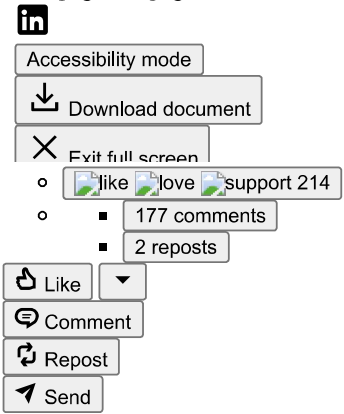

• Feed post number 37

 Sandra Pellumbi in•3rd+Co-Founder& CEO| Founders are the most important person the second one-without a full-time hire| Part-time AI-trained EAs+ operational infrastructure↓Free audit

 Visit my website

 If you're always busy but never ahead, READ THIS.

You don't have a time problem.

You have a focus problem.

Even the smartest leaders unknowingly drain their energy and clarity

 by doing things that look productive on the surface.

Here are theFocus-Killing Mistakes Leaders Still Make:

1/ Being too available

 Constant accessibility creates decision fatigue.

2/ Starting the day without a strategy

 Email first= other people's priorities.

3/ Keeping notifications on all day

 Every ping fractures deep focus.

4/ Overbooking your calendar

 No white space= no strategic thinking.

5/ Trying to do it all yourself

 Control kills scale(and your energy).

6/ Jumping between priorities

 Context switching slows down everything.

7/ Saying“yes” out of guilt

 You dilute your impact when you please everyone.

8/ Leaving energy-draining tasks undelegated

, Buy back your time. Start with a Virtual Executive Assistant.

9/ Mistaking speed for strategy

 Fast isn't helpful if it's in the wrong direction.

10/ Avoiding mental breaks

 L Focus fatigue sneaks in when you skip rest.

Leadership clarity starts by removing what doesn't belong on your plate.

P.S. Which one of these mistakes hit home for you?

Follow Sandra Pellumbi for more.

Most founders don't need more time, they need less noise.

That's where the right support changes everything.

We pair you with a Virtual Executive Assistant who operates as your execution partner- protecting your time, organizing your world, and keeping things moving without you chasing them.

DM me"FOCUS" or we can explore it together on a quick call.

Activate to view larger image,

by Sandra Rellumbi

10 Focus-Killing Mistakes Leaders Still Make

1. Being Too Available

Constant accessibility creates decision fatigue and distraction.

Set clear availability blocks.Empower your team to think independently.

4. Trying to Do It All Yourself

Control kills scale and your energy.

Delegate outcomes,not checklists.

6. Jumping Between priorities

Context switching= slowdecisions, slow days.

Theme your days.Anchor deep work early.

8.Leaving Energy-Draining Tasks Undelegated

Your best energyshouldn't be spent on admin.

Buy back your time.Start with a Virtual Executive Assistant.

2. Starting the Day Without a Strategy

Checking email first=working on other people's priorities.

Tackle your most strategic task before anything else.

9.Mistaking Speed for Strategy

Moving fast isn't progress if you're headed in the wrong direction.

Pause.Reflect.Act with intention.

3. Keeping Notifications On All Day

Every ping fractures your attention span.

Silence non-essentials.Batch your responses.

Overbooking Your Calendar

Meetings and tasks crammed back-to-back drain mental clarity.

Leave space to think.Protect white space like strategy time.

Saying"Yes" Out of Guilt

Every yes to the wrong thing is a no to your mission.

Use clarity,not emotion,to make commitments.

10. Avoiding Mental Breaks

Focus fatigue builds silentlyand sabotages clarity.

Take short"reset" every 90-120 minutes.

Activate to view larger image,

like love support 303

hcal{O}$ 173 comments

20 reposts

 LikeComment

Repost

Send

$$\text{. Feed post number 38}$$

 Sandra Pellumbi in  $\cdot 3 rd+$ Co-Founder\& CEO| Founders are the most important person in their business and the most exhausted. I fix the second one-without a full-time hire| Part-time AI-trained EAs+ operational infrastructure↓ Free audittrained EAs+ operational$$\text{ infrastructure}$$Free audit

...

The things that scare you the most are usually the things that change you the most.

We often think fear shows up when something is wrong.

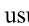ually appears when something meaningful is on the line.

Not danger-growth.

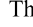might recognize:

a bigger decision... and suddenly everything in you feels loud.

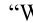What if I mess this up?"

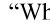What will people think?"

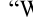at if I'm not ready?"

It's not incompetence.

It's not weakness.

It's the human side of stepping into something unfamiliar.

And yes, mistakes will happen.

People may have opinions.

Your first attempt might not look perfect.

But the truth:

If it didn't matter, you wouldn't feel anything at all.

Indifference shows up when something isn't aligned with your direction.

Fear shows up when something is.

That tension you feel?

It's the stretch of stepping into a version of yourself you haven't met yet.

Fear isn't the enemy.

Avoidance is.

Most of what we fear isn't the outcome, it's the emotional discomfort surrounding it:

Embarrassment.

Rejection.

Not being understood.

Being seen trying.

But growth requires being seen trying.

If something in your life or business is scaring you right now, don't run from it.

Lean in.

Get curious.

Move forward quietly if you have to.

Because the fear you feel today might be the evidence that you're finally doing something that matters.

P.S. What's the leap you know you need to take this year?

Repost to help someone else take their next brave step.

Follow Sandra Pellumbi for more leadership and growth insights.

When it feels scary to jump, that is when you Jump, otherwise you end up staying in the same place your whole life.

- Alex Morales

Activate to view larger image,

o like love support 612$$\begin{align*}&\text{o}\\ &\text{Like}\end{align*}$$■207 comments■47 reposts

 Comment

 Repost

1 S

• Feed post number 39

 Sandra Pellumbi in  $\cdot$  3rd+ Co-Founder\& CEO| Founders are the most important person in their business and the most exhausted. I fix the second onewithout a full-time hire| Part-time AI-trained EAs+ operational infrastructure  $\downarrow$  Free audit Visit my website

1mo·

$$+\text{ Follow}$$

$$\cdots$$

Most people think growth looks loud.

Fast. Visible. Impressive.

It doesn't.

Real growth is quiet work you do when no one's watching:

- Taking care of your health so you don't burn out later

- Practicing your craft when no one's watching

- Catching your thoughts before they run the show

- Letting your values guide decisions, not pressure

- Staying curious instead of stuck

- Showing up on the days motivation doesn't

This is the work that doesn't expire.

The kind no title, algorithm, or circumstance can take from you.

And every time you slow down, reset, and keep moving forward, you're reinforcing one simple truth:You are worth the effort.

This is the work no one applauds but it changes everything.

Repost to remind someone.

Follow Sandra Pellumbi for impactful insights on growth and leadership.

Activate to view larger image,

FRIENDLY REMINDER:

YOU ARE THE GREATEST PRODECT YOU'LL EVER WORK ON.

YOU ARE ALLOWED TO RESTART, REFOCUS,RESET. AS MANY TIMES AS YOU NEED.

Activate to view larger image,

o like love support 819 $\circ$ ■215 comments$$\blacksquare$$66 reposts

 Like Comment

 Repost

• Feed post number 40

 Sandra Pellumbi in· 3rdCo-Founder& CEO| Founders are the most important person in second onewithout a full-time hire| Part-time Free audit website

+...

When I lost the mayoral election, it felt like the ground disappeared beneath me.

It wasn't just a public loss.

It was personal.

I had built my identity around the role I thought I was meant to step into.

And when it didn't happen, I had to face a harder question:

Who am I without the title?

That season felt exactly like the caterpillar in this image,

no longer who it was, not yet who it would become.

The cocoon stage is the part no one talks about:

.The quiet

●The self-reflection

.The uncomfortable rebuilding

.The grieving of the identity you worked so hard to create

 But here's the beauty:

What I thought was the end...

became my new beginning.

Today, I run a business I love.

I help founders and executives create clarity, capacity, and breathing room so they can lead with purpose, not pressure.

I stopped chasing significance.

I started building something meaningful.

And I found a life with more purpose, more peace, and more alignment than any title would have ever given me.

And that feels like flight.

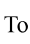To anyone in a transition

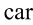career, identity, leadership, life:

If everything feels uncertain, you're not failing.

You're transforming.

Your wings may just be unfolding.

God has a purpose for this season, too.

P.S. Which stage are you in right now?

Beginning

 Rebuilding

Becoming

 Comment with the emoji. Let's see where everyone is

If this landed for you, don't keep it yourself, someone else needs this reminder today.

Follow Sandra Pellumbi for more.

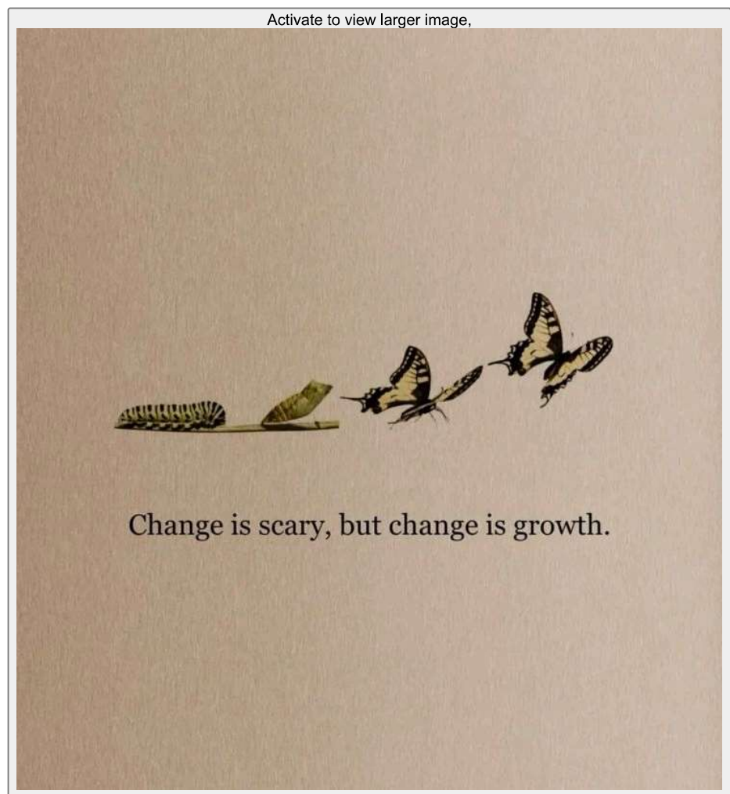

Activate to view larger image,

• Feed post number 41

Sandra Pellumbi$$\text{ Pellumbi}\text{ in}\cdot 3 r$$Co-Founder\& CEO| Founders are the most important person in their business and the most exhausted. I fix the second one-without a full-time hire-time hire| Part-timetrained EAs+ operational infrastructure  $\downarrow$  Free audit Visit mywebsite

 Visit my 1mo•

what most people won't tell you about time:

It's not about working faster.

It's about removing what shouldn't be on your plate in the first place.

High-performing leaders don't get more hours in the day.

They just protect their time differently.

Here are 10 of my favorite ones I share with founders, executives, and high-performers ready to stop drowning in busywork:

1. Calendar Gatekeeping

 If it's not aligned with your top 3 prioritiesdecline, defer, or delegate.

2. Delegation With Guardrails

 Don't just assign tasks. Share the outcome, context, and authority level then step back.

3. Kill Meetings That Don't Earn Their Place

, No agenda? No clear outcome? Cancel it or make it async.

4. Block Focus Time Like a CEO

 Guard 90-minute blocks for deep work. Let your team know they're sacred.

5. Use‘No’ As a Leadership Tool

 Every yes costs you something. Protect your strategic energy.

6. Asynchronous First

 Default to Loom, Slack, or Notion updates before jumping into calls.

7. Pre-Decide Repetitive Decisions

 Create rules for the repeatable. Batch emails. Standardize responses. Free up mental space.

8. Limit Your App Stack

 More tools= more chaos. Audit every 90 days. Keep only what matters.

9. Delegate the Input, Own the Decision

 Let your assistant or team gather the info so you can decide in minutes, not hours.

10. Protect Your Energy, Not Just Time

 Cut what drains you. Prioritize what fuels you. Energy is your true productivity multiplier.

If any of these hit home, here's your sign to pause and ask:

What's quietly stealing your time and what can you start reclaiming today?

Save it.Repost it.Follow Sandra Pellumbi for more.

I'm Sandra. We help founders and CEOs win back their time and peace of mind through better structure, clear delegation, and subscription-based access to

 world-class Virtual Executive Assistants who act as their execution partners.

If you're ready to stop carrying every moving piece alone, message me"Delegate" or book a free strategy call to see how it workshttps://lnkd.in/dxR3Ht67

Activate to view larger image,

by Sandra Rellumbi

10 Quiet Power Moves

That Buy Back Your Time

1.Calendar Gatekeeping

 If it's not aligned with your top 3 priorities,decline, defer, or delegate.

2. Delegation With Guardrails

Don't just hand off tasks.Clarify the outcome,context, and authority level, then step back.

4. Block Focus Time Like a CEO

Protect 90-minute blocks for deep work. Let the team know those slots are non-negotiable.

3. Kill Meetings That

Don't Earn Their Place

No agenda? No clear outcome? Cancel it or move it to async.

5. Use'No' As a

Leadership Tool

Every yes is a trade.Say no more often to protect your strategic capacity.

6. Asynchronous First

Default to Loom,Slack,or Notion updates before booking calls.Reduce real-time interruptions.

9. Delegate the Input,Own the Decision

8.Limit Your App Stack

Too many tools create noise. Audit every 90 days. Consolidate or eliminate what's not essential.

Have your assistant or team gather research,summarize options, and prep choices, then you decide fast.

7. Pre-Decide Repetitive Decisions

Create rules for low-value choices(e.g.,batching emails,standard responses,toolkits).

10. Protect Your Energy,Not Just Time

Cancel what drains you.Invest in what fuels you.Energy is the multiplier of all productivity.

FIND THIS VALUABLE? FOLLOW SANDRA PELLUMBI FOR MORE

REPOST THIS TO HELP YOUR NETWORK

Activate to view larger image,

o like support love 259

 $\sigma$ 162 comments

reposts

LikeComment

Repost

Send

• Feed post number 42

Co-Founder\& CEO| Founders are the most important person in their business and the most exhausted. I fix the second one-without a full-time hire| Part-time AI-trained EAs+ operational infrastructure Free audit Visit my website

1mo·

+ Follow

 $\cdots$ 

No one thinks their inbox is the problem.

Until they look closely.

And realize...

the business isn't slowing down.

It's leaking.

Your inbox is not just messages.

It's:

→Deals waiting for a reply

→Partnerships waiting for a decision

→Leads waiting for momentum

 And most of them don't get lost.

They get ignored just long enough to disappear.

1/ Unanswered leads

 Ready buyers... no reply

 Fix: EA responds within hours, not days

2/ Delayed replies

 Interest cools fast

 Fix: Set SLAs, EA owns first response

3/ Forgotten follow-ups

“I'll circle back” never happens

 Fix: EA tracks daily follow-ups

4/ Buried partnerships

 Lost under noise

 Fix: EA surfaces high-value threads

5/ Missed introductions

 Warm doors close quietly

 Fix: Tag and prioritize immediately

6/ Ignored requests

 Invites and collabs unseen

 Fix: Daily triage with clear ownership

7/ Late responses

 Right message, wrong timing

 Fix: EA manages urgency windows

8/ Poor tracking

 Conversations go nowhere

 Fix: EA tracks in CRM or simple system

9/ Lost context

 Details get messy

 Fix: EA organizes and summarizes threads

10/ No prioritization

 Everything feels urgent

 Fix: EA enforces daily priorities

 It's not that you don't have time.

It's that the moments that actually move your business forward...

are scattered, unowned, and quietly slipping past you every single day.

If this feels familiar, DM me“Delegate”

and I'll share how we structure this so nothing slips again.

Repost to help other leaders.

Follow Sandra Pellumbi for more insights on building a self-running business that doesn't rely on you for every moving piece.

10 Missed pportunities Hiding in Your Inbox

1. Unanswered leads

People who were ready...and never heard back

 Fix: Your EA flags and replies within hours,not days.

2. Delayed replies

Interest cools fast when response is slow

 Fix: Set response SLAs and let your EA manage first-touch replies

4. Buried partnerships

 Great opportunities sitting under newsletters and noise

 Fix: Your EA filters and surfaces high-value conversations

6. Ignored requests

 Invites, collabs, client asks left unseen

 Fix:Daily inbox triage with clear categories and ownership

8. Poor tracking

Conversations happening... but nowhere recorded

9. Lost context

 Threads get messy,details get lost

 Fix: Sync inbox to CRM or simple tracking system owned by your EA

 Fix: Your EA summarizes,organizes, and maintains context

3. Forgotten follow-ups

"I'll circle back" that never happens

 Fix: Build a follow-up system your EA tracks daily

5.Missed introductions

 Warm intros that quietly expire

 Fix:Tag and prioritize intros as high-urgency tasks

7. Late responses

 Replying when it's already too late Fix: Your EA manages urgency levels and timing windows

10. No prioritization

 Everything looks equally important

 Fix: Define what matters and let your EA enforce it daily

FIND THIS VALUABLE? FOLLOW SANDRA PELLUMBI FOR MORE

 Activate to view larger image,

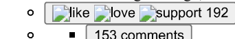

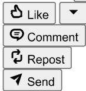

- Feed post number 43

Sandra Pellumbi in.Founders are the most important person in their business and the most exhausted. I fix the second onewithout a full-time hire| Part-time AI-trained EAs+ operational infrastructure↓ Free audit time trained time AI-trained EAs+ operational infrastructure Visit my website

1mo•

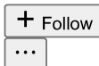

 The best investment you'll ever make isn't on a perfect resume...

it's on potential.

We often hear about hiring"perfect candidates," but here's the truth:

Most jobs are trainable.

But what's rare is the willingness to invest in someone's growth.

The rarest thing today is someone willing to give a chance.

I've seen this firsthand, people who started with no fancy credentials but brought relentless drive.

With the right opportunity, they grew into game-changing team members.

And yet, many companies still filter out candidates who don't"check all the boxes."

Here's why potential outperforms perfection:

1/ Drive Can't Be Taught

 Skills can be learned, but hunger comes from within

 The most valuable asset is someone willing to grow

2/ Fresh Eyes See Solutions

 Industry veterans often have industry blindspots

 L New perspectives spark innovation

3/ Loyalty Runs Deeper

 People remember who gave them their shot

, Investment in potential creates long-term advocates

 The real risk isn't hiring someone unproven.

It's missing out on tomorrow's gamechangers.

Here's what to look for instead:

1/ Learning Velocity

 How fast do they absorb new information?

Do they actively seek growth opportunities?

2/ Problem-Solving Drive

 Do they find solutions or wait for instructions?

Can they think beyond their current toolkit?

3/ Cultural Addition

 What new perspective do they bring?

How do they complement existing strengths?

So if you're hiring?

Look beyond the checklist.

Watch for:

Learning agility

Problem-solving instinct

Values that uplift your culture

 Remember:

Every expert started as a beginner.

Every leader started as a follower.

Every success story started with someone taking a chance.

Bonus Tip for Remote Hiring Success is in the comments section.

P.S. When was the last time someone believed in you and gave you an opportunity? How did it impact your career?

Repost to help others think differently about hiring.+ Follow Sandra Pellumbi for more.

Follow Sandra Pellumbi for more.Repost to help others think differently about hiring.+ Follow Sandra Pellumbi for more.

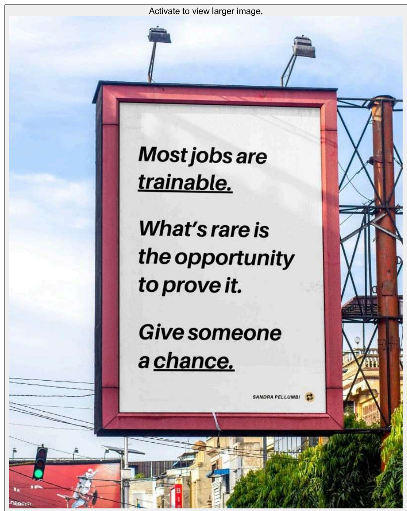

Activate to view larger image,

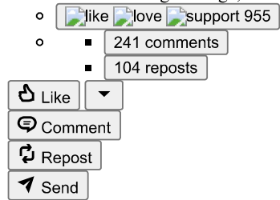

• Feed post number 44

Sandra Pellumbi in  $\cdot$  3rd+ Co-Founder\& CEO  $|$  Founders are the most I fix the$$\text{ one-without}$$a full-time hire| Part-time AI-trained EAs+ operational infrastructure↓ Free audit website

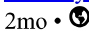

No one talks about this part of building a business...

From the outside, it looks like momentum.

On the inside, it feels like pressure.

I was speaking with a founder recently.

She was doing everything right.

Revenue growing.

Clients happy.

Team expanding.

On paper, it looked like she had it together.

file:///G:/My Drive/LinkedIn Content Creators Pages to Study/Post Activity_ Sandra Pellumbi_ LinkedIn.html

But behind the scenes?

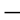Her day started before everyone else.

→Inbox already full before 9am.

Back-to-back calls.

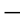Slack messages stacking.

Notes scattered across tabs.

By evening, she was still catching up.

She told me:

“I can’t switch off. Even when I try... I feel like something’s slipping.”

That quiet, constant pressure.

And the pressure wasn't coming from the business...

It was coming from everything still running through her.

10 Founder Pressures No One Talks About:

1/ Always“on”

You're the default for everything.

Fix: Create decision lanes and let someone own first responses.

2/ Never fully disconnecting

 Even off-hours feel like standby mode.

Fix: Have an EA filter what actually needs you vs what can wait.

3/ Decision fatigue

 Small decisions pile up until you're drained.

Fix: Document standards so decisions don't restart every day.

4/ Carrying responsibility alone

 Everything ultimately lands on you.

Fix: Shift ownership, not just tasks.

5/ Fear of things breaking

 You're holding the system together in your head.

Fix: Build visible systems that don't rely on memory.

6/ Constant context switching

 Different roles, different problems, all day.

Fix: Structured calendar+ protected focus blocks managed for you.

7/ Lack of structure

 Growth happened, but systems didn't catch up.

Fix: Install a simple operating rhythm your EA maintains.

8/ Team dependency

 Your team waits for direction more than they should.

Fix: Create clarity so they can move without you.

9/ Invisible workload

 Follow-ups, coordination, small tasks... they add up.

Fix: Centralize and delegate execution tracking.

10/ No mental space

 You're always thinking, never clearing.

Fix: Offload what shouldn't live in your head.

You're not burning out.

You've become the system everything depends on.

You didn't lose control.

You've been holding it all together... alone.

And that's the pressure no one sees.

If this resonates, comment"RELIEF" and I'll send you this free 1-page breakdown:

The Founder Relief Map: How to Reclaim 15-20 Hours Without Hiring a Full Team"

Repost this to help your network.

Follow Sandra Pellumbi for more.

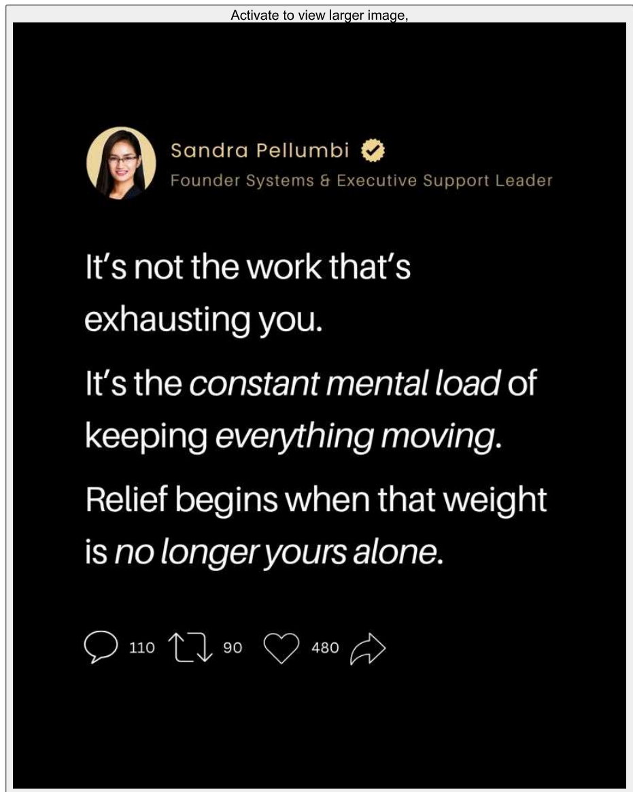

Activate to view larger image,

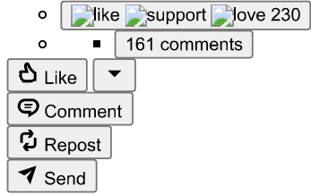

· Feed post number 45

Sandra Pellumbi in  $\cdot$  3rd+ Co-Founder\& CEO| Founders are the mo siness and most exhausted.I fix the second onewithout a full-time hire| Part-time AI-trained EAs+ operational Visit my website

2mo•

It doesn't look like a problem at first.

It looks like a busy day.

He opened his laptop at 8:30 AM.

“Quick inbox check.”

One email turned into five replies.

Slack pinged.

A client asked for“just a quick call.”

A team member needed approval.

By 11:45...

He had done a lot.

But nothing that actually moved the business forward.

No strategy.

No thinking time.

No real progress.

Just... reacting.

And that's when it hit him:

He wasn't losing time.

He was losing focus.

In pieces.

Your focus isn't weak.

It's constantly being pulled.

10 Focus Killers Founders Ignore:

1. Inbox checking every 10 minutes

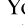You're training your brain to react, not think.

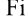Fix: Let your EA triage, summarize, and only surface what matters.

2.2. Slack interruptions all day

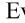Every ping resets your thinking.

Fix: Set structured communication windows your EA enforces.

3. Unplanned meetings

 Your calendar gets filled by others' priorities.

Fix: Your EA filters, qualifies, and protects your schedule.

4. Constant context switching

 You jump from sales→ops→client→admin.

Fix: Batch work. Let your EA hold the operational threads.

5. No deep work blocks

 Your best thinking never gets space.

Fix: Your EA locks in protected, non-negotiable focus time.

6. Notifications everywhere

 Your attention is being auctioned off.

Fix: Default off. EA escalates only what's urgent.

7. Last-minute requests

 Everything feels urgent when there's no system.

Fix: EA creates structure, timelines, and expectation setting.

8. Poor scheduling

 Back-to-back chaos drains decision quality.

Fix: EA designs your calendar around energy, not availability.

9. Mental task tracking

 You're carrying everything in your head.

Fix: Externalize into a system your EA owns and maintains.

10. Decision fatigue

 Too many small decisions= no energy for big ones.

Fix: EA handles low-level decisions with clear rules and ownership.

You're not distracted.

You're constantly interrupted.

Focus isn't something you“find.”

It's something you protect.

If this feels familiar, DM me“FOCUS” and I'll share what I'd fix first in your workflow.

Activate to view larger image,

by Sandra Pellumbi

10 Things Destroying Your Focus Every Day

1. Inbox checking every 10 minutes

 You're training your brain to react, not think.

Fix: Let your EA triage,summarize, and only surface what matters.

4. Constant context switching

You jump from sales→→client→admin.Fix:Batch work.Let your EA hold the operational threads.

6.Notifications everywhere

Your attention is beingauctioned off.

Fix: Default off.EA escalates only what's urgent.

8. Poor scheduling

Back-to-back chaos drains decision quality.Fix:EA designs your

 Fix:EA designs your calendar around energy,not availability.

2. Slack interruptions all day

Every ping resets your thinking.

Fix: Set structured communication windows your EA enforces.

9. Mental task tracking

You're carrying everything in your head.

Fix: Externalize into a system your EA owns and maintains.

3. Unplanned meetings

Your calendar gets filled by others' priorities.

Fix: Your EA filters,

qualifies, and protects your schedule.

5. No deep work blocks

Your best thinking never gets space.

Fix: Your EA locks in protected, non-negotiable focus time.

7. Last-minute requests

Everything feels urgent when there's no system.Fix:EA creates structure,timelines, and expectation setting.

10. Decision fatigue

Tooany small decisions= noenergy for big ones.

Fix:handles low-level decisions with clear rules and ownership.

FIND THIS VALUABLE? FOLLOW SANDRA PELLUMBI FOR MORE

REPOST THIS TO HELP YOUR NETWORK

Activate to view larger image,

 $\circ$ like support love 394

c$ 167 comments

35 reposts

 Like▼Comment

$$\text{ Repost}$$

1 Send

$$\text{. Feed post number 46}$$

a Pellumbi in  $\cdot$  3rd+ Co-Founder\& CEO| Founders are the most important person in their business and the most exhausted. I fix the second one-without.Part-time AI-trained EAs+ operational infrastructure Free audit

stems you ignore today

 become the chaos you fight tomorrow.

No one really tells you this early on.

Because in the beginning, it does not feel like chaos.

It feels like momentum.

You are replying fast.

Saying yes.

Keeping the wheels turning.

For a while, it even feels responsible.

Until one day you look up and realize

 you are working nonstop

 but the business is not really moving.

That was my turning point.

I was not dealing with loud problems.

I was dealing with quiet ones.

The kind that slowly tax your time, focus, and energy.

Here are the 10 silent time killers I found quietly running underneath my business and what actually fixed them:

1/ Unclear priorities

 Everything feels urgent, so nothing truly moves.

FIX: Set your top three weekly priorities and have your EA reinforce focus across the team.

2/ Manual tasks that should be automated

 Founder energy gets drained by repeatable work.

FIX: Have your EA audit recurring tasks and implement simple automations.

3/ Reactive communication

 You are always in response mode instead of leadership mode.

FIX: Let your EA triage inbox and Slack so you can protect focus time.

4/ Undefined roles

 When everyone helps, ownership disappears.

FIX: Assign one clear owner per function and document it visibly.

5/ Decision bottlenecks

 Growth slows every time work waits for you.

FIX: Define decision rules and empower your EA to move routine approvals forward.

6/ No centralized SOPs

 You keep re explaining instead of scaling.

FIX: Task your EA to build and maintain your central SOP hub.

7/ Overfilled calendar

 Meetings multiply when systems do not.

FIX: Have your EA audit, decline, and restructure your calendar weekly.

8/ Disorganized files

 Time gets lost searching instead of executing.

FIX: Let your EA implement and enforce a clean file structure.

9/ Zero delegation protocol

 Tasks move, but true ownership does not.

FIX: Delegate outcomes with clear success metrics and deadlines.

10/ No review rhythm

 Chaos repeats itself, just faster.

FIX: Have your EA run a weekly review cadence and surface risks early.

They rarely look dramatic in the moment.

But together

 they quietly steal your momentum.

Structure is how you get it back.

Not more hours.

Not more hustle.

Better systems.

Better ownership.

And the right support beside you.

P.S. Which one of these silent time killers is quietly showing up in your business right now?

This is exactly the gap the Force Multiplier OS was built to solve.

We help founders remove the silent time leaks

 through better structure, clear delegation,

and a world class Virtual Executive Assistant who actually thinks with you.

So the business moves without everything sitting on your shoulders.

DM me"OS" or explore here: https://lnkd.in/dxR3Ht67

Activate to view larger image,

by Sandra Rellumbi

Spot the 10 Silent Time Killers in Your Business

1.Unclear Priorities

 Everything feels urgent, so real progress gets buried.

FIX: Set top three priorities weekly and have your EA reinforce focus across the team.

4. Undefined Roles

When everyone helps,ownership disappears.

X: Assign one clear owner per function and document it visibly.

6.No Centralized SOPs

You keep re explaining instead of scaling.

FIX: Task your EA to build and maintain your central SOP hub.

8.Disorganized Files and Info

Small searches quietlydrain hours each week.

FIX: Let your EA implement and enforce a clean filestructure.

2.Manual Tasks That Should Be Automated

You are spending human energy on repeatable work.FIX: Audit recurring tasks monthly and automate the obvious wins.

9.Zero Delegation Protocol

Tasks move, but true ownership does not.

FIX: Delegate outcomes with clear success metrics and deadlines.

3.Reactive Communication

Constant pings keep you in survival mode.

FIX: Let your EA triage inbox and Slack so you can protect focus time.

5. Decision Bottlenecks

Growth slows every time work waits for you.

FIX: Define decision rights and empower your team to act.

7.Overfilled Calendar

Meetingexpand when systems are weak.are weak.

Replace status meetings with dashboards and async updates.

10. Lack of Review Rhythm

Without reflection, chaos repeats faster.Without reflection, chaos faster.

FIX:tall a weekly review to catch issues early.

FIND THIS VALUABLE? FOLLOW SANDRA PELLUMBI FOR MORE

REPOST THIS TO HELP YOUR NETWORK

Activate to view larger image,

like love insightful 272

c$ comments

11 reposts

 LikeComment

Send

• Feed post number 47

Co-Founder\& CEO| Founders are the most important person in their business and the most exhausted. I fix the second one-without a-time AI-trained EAs+ operational infrastructure Free audit Visit my website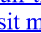website

 mo.

people don't realize this.

The gap isn't ideas.

It's how fast you can turn them into something real.

Most people think they need better ideas.

They don't.

They need less friction.

Because every idea comes with effort:

 $\rightarrow$  Open a tool.

→Figure out a layout.

→Make it look decent.

So instead of creating...

you delay.

And delayed ideas don't compound.

I've been changing how I work.

Instead of designing,

I describe what I want.It gets generated.

Then I refine it:

→Cleaner.

 $\rightarrow$  Sharper.

 $\xrightarrow{}$  Done.

I've been using Gamma's Imagine feature for this.

What changed isn't just speed.

It's removing the gap between thinking and creating.

And once that gap is gone,

You stop hesitating.

You just ship.

Think of it as your AI design partner.

Try it freehttps://lnkd.in/dCh6z39W

 P.S. Curious, what slows you down more

 coming up with ideas, or executing them?

Your document is loading

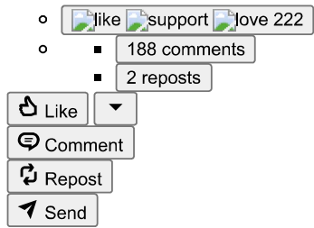

• Feed post number 48

Sandra Pellumbi.3rd+Co-Founder& CEO| Founders are the most important person and the most exhausted. I fix the second one-without a full-time hireAI-trained EAs+ operational infrastructure Free audit website

2mo  $+$  Follow

 I notice this quiet pattern in so many capable people.

They downplay what they know.

Second-guess what they feel.

Pause right before they step forward.

Not because they're unprepared

 but because they've learned to doubt themselves faster than they doubt the situation.

→We don't submit the proposal.

→We don't send the message.

→We don't apply, publish, pitch, or ask.

$$\text{.}$$

.Most doors don't close on us

 we quietly close them ourselves.

Talent isn't the problem.

Capability isn't the problem.

Courage to move before certainty is.

So let this be your reminder today:

→Apply anyway.

→Share it anyway.

 $\rightarrow$  Send it anyway.

→Ask anyway.

You are far more capable than the version of you that hesitates.

Don't disqualify yourself before anyone else does.$$\text{ before anyone else does.}$$

PS. If this resonated, repost and follow Sandra Pellumbi for more.

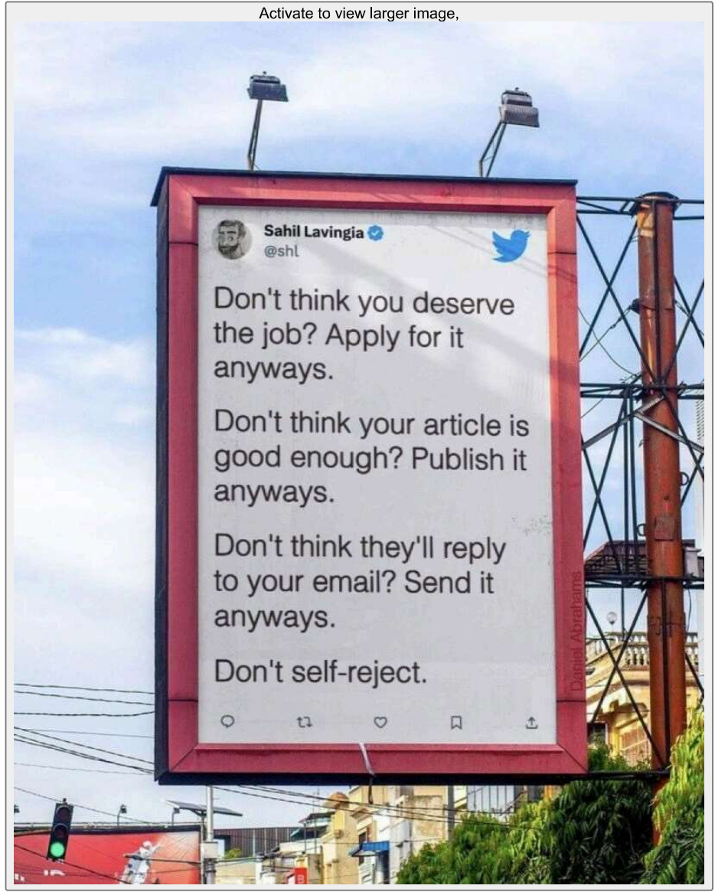

Activate to view larger image,

■198 comments

63 reposts

 Like▼Comment

 Repost

1 Send

• Feed post number 49

 Sandra Pellumbi in  $\bullet$  3rd+ Co-Founder\& CEO| Founders are the most importan second onewithout a full-time hire| Part-time AI-trained EAs+ operational infrastructure| Free audit website

$$\text{unders don't realize this:}$$

Doing everything yourself isn't saving money. It's quietly costing you growth.

The mistake:

You stay involved in every detail to"keep things high quality."

But now everything waits on you.

Approvals.

→Replies.

 $\rightarrow$  Decisions.

→Follow-ups.

The cost:

→Slower execution

→missed opportunities

 $\rightarrow$  and a business that can't move unless you do.

The fix is counterintuitive:

Stop trying to stay on top of everything.

Start stepping out of it.

Start removing yourself as the center of execution:

1/ Assign clear ownership.

2/ Build systems.

3/ Hire a strategic executive assistant who ensures things move without you.

You don't need more hours.

You need fewer dependencies on you.

When someone else owns the flow, things move faster and you finally get back to the work only you can do.

Where in your business are things still waiting on you right now?

Repost this to help your network.

Follow Sandra Pellumbi for more.

I'm Sandra. I help founders and CEOs remove themselves as the center of execution by building structure, clear ownership, and installing a world-class Virtual ecutive Assistant who keeps everything moving without them.

If your business still depends on you to move forward, message me"Delegate" or book a free strategy call to see how we fix that: https://lnkd.in/dxR3Ht67

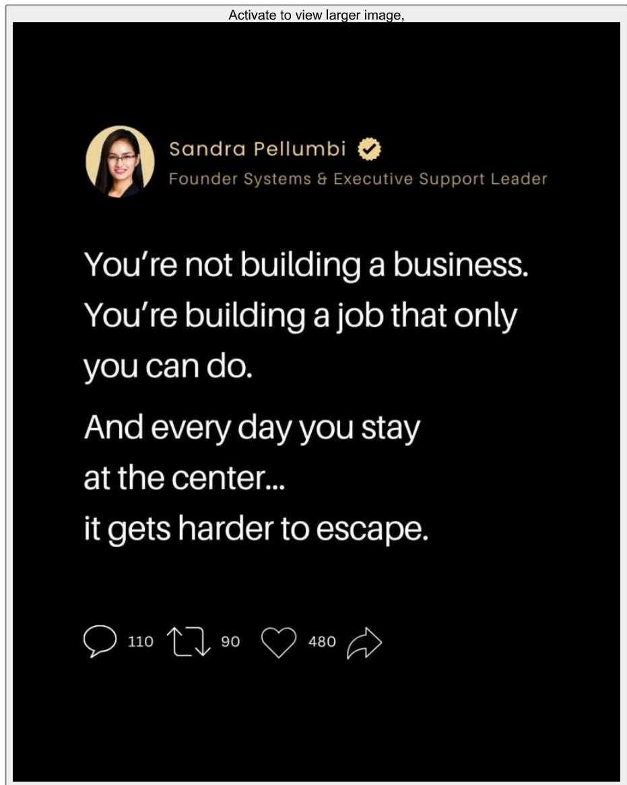

Activate to view larger image,

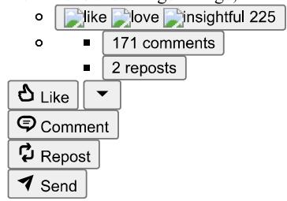

• Feed post number 50

Sandra Pellumbi in  $\cdot 3$  rd+ Co-Founder\& CEO| Founders are the most important person in their business and the most exhausted. I fix the second one-without a full-time hire| Part-time AI-trained EAs+ operational infrastructure Free audit Visit my website

2mo·

+ Follow

…

We have a bad habit in leadership.

We think that if we worry enough, we can control the outcome.

We spend our days mentally rehearsing the difficult conversation, the lost client, or the cash crunch.

But I read something recently that changed my perspective:

"Your mind is not predicting reality, it is practicing it."

Think about that.

If you practice stress all day, your body gets really good at being stressed.

You are teaching your nervous system that you are under attack, even when you're just sitting at your desk.

You are allowed to practice the win, too.

You are allowed to visualize the deal closing.

You are allowed to feel calm before the problem is solved.

Give your mind better material to work with. It will return the favor.

Take 60 seconds right now. Visualize everything going right. How does that feel?

I hope you win more than you stress this week!

Photo credit:_awaken_one_

Reshare if you agree we need to stop normalizing burnout.

Follow Sandra Pellumbi for more.

I'm Sandra. I help founders and CEOs get out of constant mental overload by installing better structure, clear ownership, and a world class Virtual Executive sistant who keeps things moving without you carrying it all.

If your mind feels like it's always"on," message me"Delegate" or book a free strategy call to see how we fix that: https://lnkd.in/dxR3Ht67

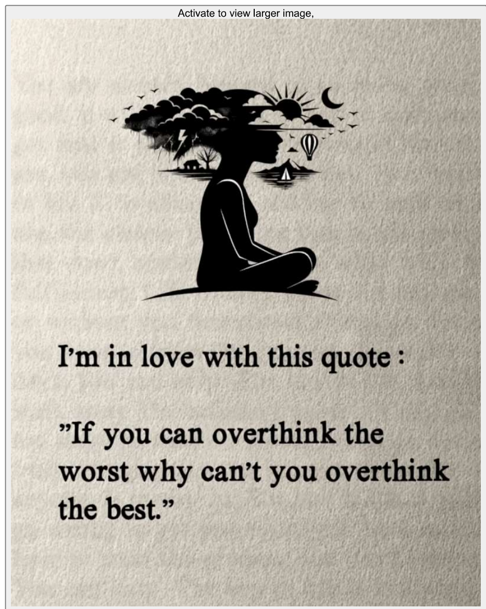

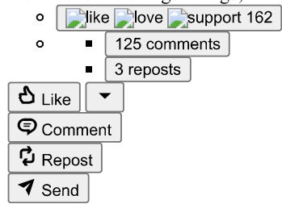

. Feed post number 51

Sandra Pellumbi in  $\cdot$  3rd+ Co-Founder& CEO| Founders are the most important person in their business and the most exhausted. I fix the second one-without a full-time hire| Part-time AI-trained EAs+ operational infrastructure Free audit website

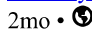

10 Leadership Habits Draining the Life Out of Your Team:

(and what to do instead)

You don't need to yell to burn your team out.

Exhaustion isn't always loud.

Sometimes,

-it's quiet compliance,

-slow disengagement,

-and high turnover.

Burnout doesn't just come from workload.

It comes from how people are led.

Here are 10 common leadership mistakes that lead to burnout, and how to flip the script:

1. Being Always“Available” Means They Have to Be, Too

 Availability  $\neq$  accessibility.

Instead: Set boundaries and normalize disconnecting.

2. Delegating Tasks, But Not Trust

 If they have to ask permission for every decision, they're not owning the work.

Instead: Delegate outcomes, not just to-do's.

3. Performance> People

 Metrics matter but people do, too.

Instead: Balance the numbers with regular human check-ins.

4. Meetings That Drain Instead of Drive

 Too many meetings= too little thinking time.

Instead: Protect deep work and make meetings meaningful.

5. Unclear Priorities= Confused Teams

 Everything can't be top priority.

Instead: Make it crystal clear what moves the needle.

6. Rewarding Overwork with... More Work

 Your best people aren't bottomless.

Instead: Build support around them, not on top of them.

7. Skipping Small Wins

 Waiting for big milestones kills momentum.

Instead: Celebrate progress, not just perfection.

8. Lack of Career Conversations

“We’ll talk growth later” is a morale killer.

Instead: Show them they have a future-now.

9. Assuming Silence= Satisfaction

 Just because they're not complaining doesn't mean they're okay.

Instead: Ask often. Listen deeply.

10. Leading Like a Machine in a Human World

 Over-efficiency kills connection.

Instead: Be real, not robotic.

A reminder for every leader:

Your energy is contagious. So is your stress.

Leadership doesn't require perfection

 just awareness.

Fixing even one of these can change how your team feels, performs, and stays.

P.S. What's one small shift you can make today to reduce burnout on your team?

Repost to spark better leadership

 Follow Sandra Pellumbi for more.

Activate to view larger image,

by Sandra Pellumbi

10 Leadership Mistakes That Quietly Burn Out Your Team

1. Being Always"Available"Means They Have to Be,Too

 Availability=accessibility.

Instead: Set boundaries and

2.Delegating Tasks,But Not Trust

 If they have to ask permissionfor every decision, they're notowning the work.

Instead: Delegate outcomes,not just to-do's.

3.Performance>People

Metrics matter-but people do, too.

Instead: Balance the numbers with regular human check-ins.

4. Meetings That Drain Instead of Drive

Meetings That Drain Instead of Drive

 Instead: Protect deep

 work and make meetings meaningful.

5. Unclear Priorities=Confused Teams

Everything can't be toppriority.

Instead Make it crystal clear what moves the needle.

6. Rewarding Overwork with... More Work

Your best people aren't bottomless.

Ins: Build support around them, not on top of them.

7. Skipping Small Wins

Waiting for big milestones kills momentum.

Instead: Celebrate progress,not just perfection.

8. Lack of Career Conversations

'll talk growth later" isa morale killer.

stead: Show them theyhave a future-now.

Assuming Silence=Satisfaction

Just because they're not complaining doesn't mean they're okay.

Instead: Ask often. Listen deeply.

10. Leading Like a Machine in a Human World

ency kills connection.

Instead: Be real, not robotic.

FIND THIS VALUABLE? FOLLOW SANDRA PELLUMBI FOR MORE

Activate to view larger image,

love support 337

c$ .157 comments

.46 reposts

. Feed post number 52

Co-Founder\& CEO| Founders are the most important person in their business and the most exhausted. I fix the second one-without$$\text{ Sandra Pellumbi in}\cdot 3 rd+$$Part-timeFree audit

...

founders don't realize how many mental tabs they keep open all day.

Not tasks.

Not projects.

Mental tabs.

Here's what's usually running in the background:

1/ Just ask me

 Every small decision routes to you.

2/ Same questions, different day

 Nothing answers people unless you do.

3/ Holding everything in your head You're the system of record.

4/ Double-checking delegated work You assigned it, but you're still responsible.

5/ Constant task switching Inbox. Messages. Fires. Strategy. Repeat.

6/ Never fully stepping away Even“off” time feels half-on.

7/ Tracking what's done and what's not Progress lives in your memory.

8/ Fixing things early You jump in before they break because it feels safer.

9/ Being the energy source When you slow down, everything slows down.

10/ Ending the day mentally busy Work stops. Your brain doesn't.

Individually, none of these feel dramatic.

Together, they quietly make you the bottleneck.

This is why founders feel busy but not relieved.

Why growth feels heavier instead of easier.

It's not about working harder.

It's about fewer things depending on you to function.

If even one of these felt familiar,

the real question is simple:

Which mental tab should no longer be open in your head? Comment the number that hit.

If this felt familiar, repost it so another founder sees it at the right time.

Follow Sandra Pellumbi for more.

This is what Force Multiplier OS was built to solve.lping founders put better structure in place through systems, clear delegation, and world class Virtual Executive Assistants.

DM me OS or start here: https://lnkd.in/dxR3Ht67

We look at what's still living in your head, decide what shouldn't be, and set up the support your business needs so it can run without you carrying everything.

