1.00 fications total

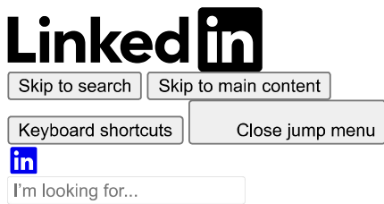

.Home

.Network

bs

●.Messaging

●23 new notifications

tifications

●●For Busines

●

Adverti

Duncan Rogoff

Founder@ The Build Room. Ex-Apple, PlayStation, Nissan.

Followers

15,605

Message

All activity

Comments

Loaded 400 Posts posts

. Feed post number 1

DunDuncan Rogoff- Following Founder@ The Build Room. Ex-Apple, PlayStation, Nissan. 2h.

...

5 files. That's the difference between Claude sounding like you and Claude sounding like everyone else.

Here's what each one does:

 $\rightarrow$  Claude.md- the pointer system. Short. Loads every session. Points to where everything else lives

 $\rightarrow$  soul.md- your story lives here. Origin, beliefs, the opinion about your industry that most people won't say out loud

 $\rightarrow$  design.md- one Pinterest screenshot becomes a full brand system. Colors, typography, layout rules- all of it

 $\rightarrow$  voice.md-trained on your actual writing. Feed it your best posts. Every output sounds like you wrote it

$$\rightarrow\text{ audience.md}-\text{ the one that converts. Claude searches Reddit and reviews for the exact phrases your ICP uses. Then uses them in every piece of content you}$$create

 Set these up once. They compound.

Comment"DONUT" and I'll send it over.

has finished loading

.1c comment

 Repost

• Feed post number 2

ncan Rogoff·Following Founder@ The Ex-Apple,PlayStation,Nissan. 3h. Edited.⑤

I built 7 Claude Code SKILLS that replaced my entire content team.

Here's how:

 $\rightarrow$  Angles: scans competitor channels for content gaps I haven't covered yet(costs 24 cents to run)

→Ideation: maps each video idea to a core audience desire like money, time, or status

→Hooks: writes scored opening scripts using my actual ICP language, not generic YouTube advice

→Titles: generates 3 tiers ranked against my own channel's top performers, not best practices

→Thumbnails: creates real 4K images matched to the video topic in seconds

→Cascade:publishes to 7 platforms simultaneously and wires lead magnet DMs automatically

→Performance: tracks what won last week and feeds it back into the next round

 The whole thing costs$5 a day to run.

I've built 200K+ followers and$250K+ in content revenue. This pipeline is the entire operation behind it.

Comment"TACO" and I'll send it over.

Activate to view larger image,

No alternative text description for this image

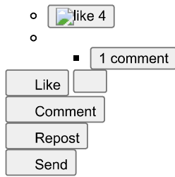

• Feed post number 3

Duncar Duncan Rogoff●Following Founder@ The Build Room. Ex-Apple,PlayStation,Nissan.1d●Edited●I talked to 519 Claude Code users in the last 10 days.

Almost every single one said the same thing before they started:

"What if I break something?"

They'd been putting it off for weeks. Months, some of them.

Watching tutorials.

Taking notes.

Telling themselves they'd start when they felt ready.

Like they knew enough to not mess up.

Here's what they found out: there's nothing to mess up.

You can't break it.

There's no code to write.

No environment to set up.

No file you'll accidentally delete.

You type what you want in plain English. Claude builds it.

Something's off? You say what's wrong. Claude fixes it.

Doing something YOUR way IS the RIGHT way.

In Claude Code Club, here's what you build:

-A memory file that makes Claude already know you before every session.

-A live website, shipped from plain English.

-A landing page with a working lead form that captures real leads.

-A first build someone would actually pay for.

- The exact systems and strategies to land clients and generate income.

You're not learning to code.

You're learning to direct.

Like+ Comment"CCC" and I'll send you the link.

Activate to view larger image,

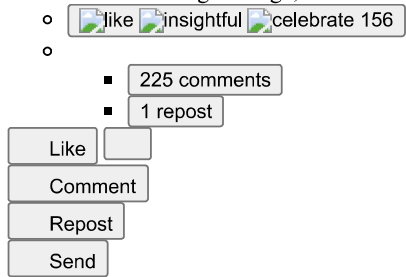

• Feed post number 4

Rogoff reposted this

 Duncar Duncan Rogoff$$\text{.}\text{.$$⑤

Stop watching tutorials. Stop saving lead magnets.

I have 427 of them. There's only one thing that works:

Building something.

I've watched 348 Claude Code tutorials.

Saved every framework. Organized folders I never opened again.

So I took everything that actually works, made it beginner-friendly, and packaged it into one place.

That's the Claude Code Club.

→Weekly builds you can ship the same day you learn them

→50 Skills,110 prompts, and 12 MCPs ready to deploy

→Real tools. Not demos. Not theory.

→No coding experience required

→Built for operators who want to build, not just watch

 Inside, you ship something real. Alongside 4,360+ builders doing the same.

Like+ comment"CCC" and I'll send you the link.

P.S. You'll watch more AI content this week no matter what. The question is whether you actually do something with it.

reposts

• Feed post number 5

Rogoff•Following Founder Following Founder@ The Build Room.pple, PlayStation, Nissan. 2d  $\bullet$  Edited  $\bullet$ 

Claude setup is WRONG!

Here are 5 Claude Code Files Every Beginner MUST HAVE!(copy me)

I went from generic AI output to content that gets 18,000+ impressions-here's the 5-file system that made it happen.

Here's how:

 $\rightarrow$  File 1:  $\underline{\text{ Claude.md}}$  - the orchestrator layer. Keep it short. It just tells Claude where to find everything else, not where your whole life story lives

$$\rightarrow\text{ File 2:}\underline{soul.md}-\text{ your origin story, beliefs, and defining moments. Claude can't sound like you until it knows the human behind the work}$$

 $\rightarrow$  File 3: design.md-your visual identity. Drop a Pinterest screenshot and one prompt. Full brand system in minutes

 $\rightarrow$  File 4:  $\text{ voice.md}$  - your exact sentence structures and what you avoid. Feed it your best posts and it learns your style

 $\rightarrow$  File 5: audience.md- your ICP's exact language pulled from Reddit and product reviews. This is the one that converts

 $\rightarrow$  These files talk to each other- only load when needed. That's how I run a 200K+ follower brand at$5/day in AI costs

 $\rightarrow$  $250K+ in content revenue. These five files are why the outputs stopped sounding generic

 Set these up before you write a single prompt. Everything changes.

Comment"DONUT" and I'll send it over.

Activate to view larger image,

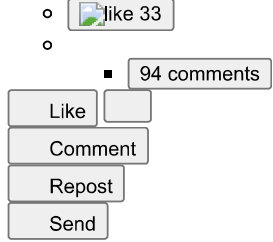

. Feed post number 6

Rogoff- Following Founder@ The Build Room. Ex-Apple, PlayStation, Nissan. 2d.④

e business used to live in 8 browser tabs.

Now it lives in one dashboard that Claude built itself.

Here's what's on the screen:

→Industry trends, drops, and competitor videos in one live feed

→The top comments on competitor posts, so I can see exactly what questions to answer

→My YouTube, LinkedIn, and Instagram stats in a single view

→A launchpad to run my most-used Claude skills with one click

→Active client and personal projects tracked beside everything else

 The build itself ran on Opus 4.8 and a new mode called Ultra Code, where one layer of agents does the work and a second layer checks it. That's why it finished while I was out of the house.

This is the kind of asset you can run your business on, or sell to clients.

Comment"PRETZEL" and I'll send it over.

Your document has finished loading like love celebrate 17 o 23 comments Like Comment Repost

• Feed post number 7

Duncar

 Duncar Duncan Rogoff•Following Fo Station, Nissan. 3d  $\bullet$  Edited  $\bullet$ 

•Following Fo Station, Nissan. 3d  $\bullet$  Edited  $\bullet$ 

Stop watching tutorials. Stop saving lead magnets.

I have 427 of them. There's only one thing that works:

Building something.

I've watched 348 Claude Code tutorials.

Saved every framework. Organized folders I never opened again.

So I took everything that actually works, made it beginner-friendly, and packaged it into one place.

That's the Claude Code Club.

→Weekly builds you can ship the same day you learn them

→50 Skills,110 prompts, and 12 MCPs ready to deploy

→Real tools. Not demos. Not theory.

→No coding experience required

→Built for operators who want to build, not just watch

 Inside, you ship something real. Alongside 4,360+ builders doing the same.

Like+ comment"CCC" and I'll send you the link.

P.S. You'll watch more AI content this week no matter what. The question is whether you actually do something with it.

2 reposts

 Like Comment Repost Send

. Feed post number 8

Rogoff• Following Following Founder@ The Build Room$$\text{. Ex-Apple, PlayStation, Nissan. 3d}\bullet$$

Comment OPEN below and I'll send you all 10 in your DMs.

Here are the top 10 open source Claude skills most builders don't know exist.

All free. All one-command install.

→ caveman-cuts token usage 75%

→graphify-knowledge graphs for your codebase

→claude-video-Claude watches your recordings

→open-design-free local design tool

→codeburn-see exactly where tokens die

→impeccable-23 commands that fix AI slop

→design-extract-pull any site's full design system

→career-ops-job search, scalpel mode

→browser-harness-Playwright that repairs itself

 The best tools are the ones you didn't know you could install.

Like this+ comment OPEN and I'll send the full list with GitHub links.

hashtag#claudecode hashtag#claude hashtag#ai hashtag#buildinpublic

• Feed post number 9

Rogoff Following Founder@ The Build Room. Ex-Apple, PlayStation, Nissan. 4d  $\bullet$ ⑤

Nobody invested in me.

Not a manager. Not a mentor. Not a company that saw potential and decided to develop it.

I spent my twenties figuring it out alone. Every hard lesson came from doing the wrong thing first. Every breakthrough came late, after I'd already paid the full price$$\text{ of not knowing.}\quad.\quad$$

That's not a complaint. It's the reason I coach.That's not a complaint. It's the reason I coach.

I know exactly what it costs to have no one in your corner who's already done what you're trying to do.

I know the feeling of being genuinely excellent at your craft and completely invisible in your market. Of building in silence and wondering if any of it is working

 The gap isn't talent. It's access.

Most of the people I work with are more capable than they look. They just have no one reflecting that back to them with any accuracy.

That's the only reason I'm here.

The Build Room exists because I refused to let the next person figure it out as slowly and expensively as I did.

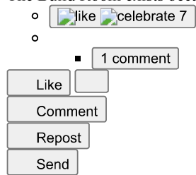

. Feed post number 10

Rogoff- Following Founder@ The Build Room. Ex-Apple, PlayStation, Nissan. 4d  $\bullet$ 

Claude Opus 4.8 built a custom operating system for my entire business in 15 minutes.

I took my dog to the vet. Came back. It was done.

Here's how it works:

→One dashboard tracks every drop, trend, and competitor in my industry

→It pulls my YouTube, LinkedIn, and Instagram stats into a single live view

→I launch my most-used Claude skills from one-click buttons

→A new mode called Ultra Code spawns a team of sub-agents that check each other's work

→That second layer of agents is why it runs for an hour with zero input from me

→It's branded to look exactly like me, because I fed it my own design system

 This is the same kind of system I now build and sell to clients.

I've grown a 200K+ following and$250K+ in revenue running on tools like this, for around$5/day in AI costs.

If you can describe your business, you can build the command center that runs it.

Comment"PRETZEL" and I'll send it over.

Activate to view larger image,

No alternative text description for this image

|  |
| --- |

 Ac

o

701 comments

■

like Like Comment Repost

. Feed post number 11

 View Duncar ncan Rogoff.Station, Nissan. 5d•...

104 modules.6 courses. One person.

No team. No agency. No 18-month timeline.

Here's exactly how the curriculum got built:

Every coaching call I ran surfaced a gap. A question I couldn't point a member to. A pattern I'd explained five times on video but never written down.

I fed those transcripts into the vault. Claude identified the recurring gaps and turned them into module outlines. I reviewed, refined, and recorded The vault tracked what was built. The coaching calls told me what to build next. Claude handled the first-draft architecture.

The tools didn't replace the thinking.

They eliminated the friction between having the insight and turning it into something a member can actually learn from.

2,000+ builders are working through that curriculum right now.

It took one system, consistently fed, to build it.

Comment"BUILD" and I'll break down the full architecture.

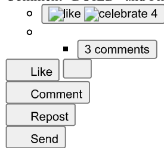

. Feed post number 12

Rogoff reposted this

 Rogoff- Following Founder@ The Build Room. Ex-Apple, PlayStation, Nissan. 1w  $\bullet$  Edited  $\bullet$ ④

Stop watching Claude Code tutorials.

I've watched over 327 of them. So I took everything that actually works, made it beginner-friendly, and packaged it for\\( 9/month.

That's the Claude Code Club.

 $\rightarrow$  Weekly builds for non-technical operators who want to ship real things

 $\rightarrow$  Skills, prompts, and systems you can use the same day

 $\rightarrow$  Real tools. Not demos. Not theory.

 $\rightarrow$  No coding experience required.

 $\rightarrow$  Price locks at  $\$  9\) . Only 24 spots left.

Inside, you ship something real. Alongside people doing the same.

Like+ Comment"CCC" and I'll send you the link.

PS- You'll watch more Claude Code content this week no matter what. The question is whether you build something with it or just feel more informed.

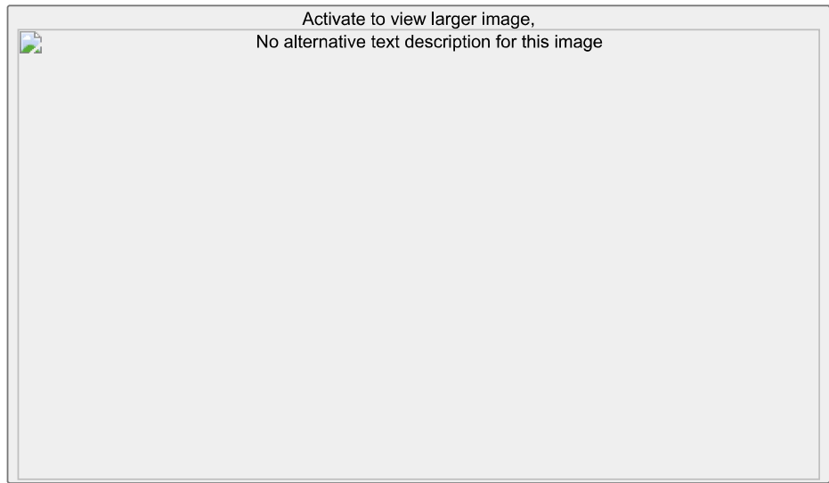

$$\text{alike love celebrate 142}$$

o

328 comments

Like Comment Repost

 Sen

. Feed post number 19

 Rogoff· Following Founder@ The Ex-Apple, PlayStation, Nissan. 1w  $\bullet$  Edited④

watching Claude Code tutorials.

I've watched over 327 of them. So I took everything that actually works, made it beginner-friendly, and packaged it for  $\$  9/ month.

file:///G:/My Drive/LinkedIn Content Creators Pages to Study/Post_Activity_ Duncan Rogoff_ LinkedIn.htm

That's the Claude Code Club.

 $\rightarrow$  Weekly builds for non-technical operators who want to ship real things

 $\rightarrow$  Skills, prompts, and systems you can use the same day

→Real tools. Not demos. Not theory.

→No coding experience required.

→Price locks at$9. Only 24 spots left.

Inside, you ship something real. Alongside people doing the same.

Like+ Comment"CCC" and I'll send you the link.

PS- You'll watch more Claude Code content this week no matter what. The question is whether you build something with it or just feel more informed.

Activate to view larger image,

No alternative text description for this image

 Activa

o

328

3 reposts

 Like Comment Repost Send

• Feed post number 20

I went from 3 hours of content planning every Sunday to zero.

Here's what I built instead:

An AI that knows my audience, my offer, and what's already working.

Every week it pulls what the ICP is talking about right now. Cross-references what's performed best on my channel. Picks the angle. Writes the brief.

I review it in 10 minutes. Then I record.

was never ideas. It was the overhead of figuring out which ideas were worth making.

Now that overhead is gone.

No more Sunday planning sessions. No more staring at a blank content calendar. No more guessing what to post next.

The system decides. I execute.

2,000+ builders are setting this up inside The Build Room.

Comment"PLAN" and I'll send you the link.

PS- If you're still planning content manually every week, you're spending hours on a problem AI can solve in minutes.

oo

18 comments

• Feed post number 39

car

 carncan Rogoff $\cdot$  Following Founder  $@$  The Build Room. Ex-Apple, PlayStation,  $\underline{\text{Nissan.}}$  3w  $\cdot$  Edited  $\cdot$ ⑤

channel had 60,000 subscribers and was growing 2x slower than every competitor in my niche.

Here's what Claude Code found in 12 minutes:

→The VidIQ MCP gives Claude Code live access to your full YouTube analytics-setup takes 30 seconds

→A short with 140,000 views drove almost zero traffic to long-form because there was no bridge between them

→My long-form titles are two tiers below my short-form titles-I could see exactly why in the data

→Claude audited 4 competitors side-by-side and pinpointed the exact gap in my content strategy

→Nick Saraev proves low volume works if the content is opinionated enough

 $\rightarrow$  The single highest-leverage fix: route every viral short to a specific long-form video with a clear CTA

 $\rightarrow$  The single highest-leverage fix: route every viral short to a specific long-form video with a clear CTA→200K+ followers built across channels. Now running the same analytical approach on YouTube.

You don't need more content. You need to know where your existing content is leaking views.

Comment"FLAMINGO" and I'll send it over.

Activate to view larger image,

No alternative text description for this image

 Activate to view larger image,

162 comments

| Like |  |
| --- | --- |
| Comment | Comment |
| Repost | Repost |

• Feed post number 40

can Rogoff- Following Founder@ The Build Room. Ex-Apple, PlayStation, Nissan. 3w  $\bullet$ ⑤

I spent 3 weeks testing every Claude Code command that actually moves the needle for business owners.

Most people are using AI like a faster typewriter. Prompt, copy, paste, save 20 minutes, repeat.

That is not the game.

I went from 1,500 to 13,000+ LinkedIn followers in under 12 months. 200K+ total followers built from content alone. No paid ads. No cold DMs.

Claude Code is a big part of how that happened.

So I pulled the 20 commands worth knowing and built a free cheat sheet around them.

Each one comes with a real business use case so you can start using it today. No coding background needed.

Here is what is inside:

> Research and competitive intel so you know what your market actually wants

> Content creation commands that write in your voice, not a generic AI voice

> Lead gen and offer positioning so the right people can find you

> Automation and systems that run without you touching them

>Plain-English explanations for every command

>Real business context for each one, not just syntax

> No developer knowledge required

> Works whether you have one hour a week or ten

> Built for owners who want output, not tutorials

 You do not need to code any of this.

You just need the right 20 commands and a reason to use each one.

Comment"COMMANDS" and I'll send it over.

PS- If you are still prompting one task at a time and closing the tab, you are not behind yet. But the gap is getting wider every week.

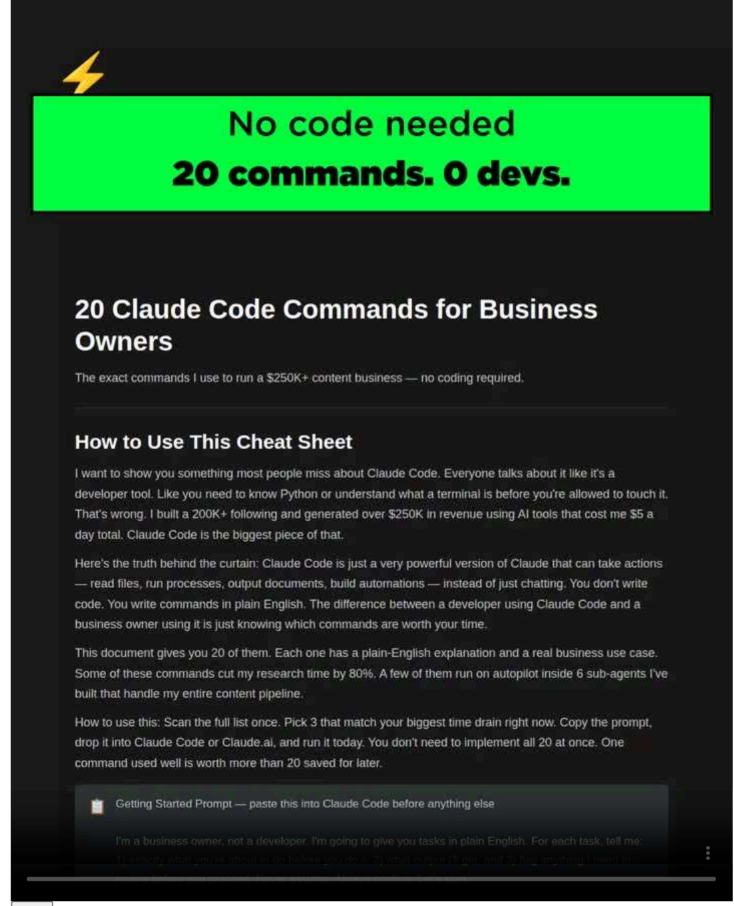

Play

 Mediais loading

 Play Play

 Loaded:60.61%60.61%

0:00

Stream Type LIVE Type LIVE

 Remaining time-0:06

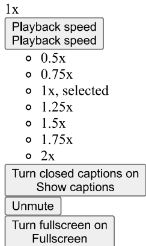

Media player modal window

 Media Attachment

2 reposts

. Feed post number 41

 Rogoff$$\bullet\text{Following Founder@ The Build Room. Ex-Apple, PlayStation, Nissan. 3w}\bullet\text{$$

My AI agents kept breaking mid-task.

Not because the tools were bad. Because the agents kept losing context, like they were starting from scratch every single time.

"I didn't write this. I didn't type this in. It figured it out" is what I wanted to say. Instead I was babysitting workflows at 11pm.

So I built a unified virtual filesystem. Every agent now reads and writes from the same place. No more lost files. No more repeated context. No more broken chains.

I put the whole setup into a free guide.

Here's what's inside:

> Why your agents keep losing context(and it's not a prompt problem)

> The exact file structure I use across all my agents

> How each agent reads and writes without stepping on each other

> The tools I use to run the filesystem(nothing expensive)

> What changes the moment this is running-agents stop needing you

> A quick-start checklist so you're set up in one sitting

> Total stack cost: under$5/day

> No coding required

> Works whether you have 1 agent or 10

Most people think broken agents are a model problem.

They're a memory problem.

This guide fixes that. The whole thing runs for under$3.50/day once it's set up.

Comment"AGENT" and I'll send it over.

PS- If you're still restarting your agents by hand every week, you're already paying the price. You're just not getting anything for it.

Agents keep failing$3.50/day. Fixed.

Stop Your Al Agents From Going Blind

watching

What This Guide Is and How to Use It

 I run 6 Al sub-agents that handle my entire content pipeline.Research, drafting,scheduling,repurposing-al of it.My total Al tooling cost is$5 a day.

For the first 4 months I babysitted every single one of them. An agent would finish a task, forget everything it

 The fix was not a better prompt. It was not a smarter model. It was giving my agents a place to live-a unifie virtual filesystem. Once every agent shared the same organized file structure and could read and write persistent state, the babysitting stopped. I got 80% of my research time back.The agents started finishing job without me.

This guide shows you exactly how I set that up. No engineering degree required. You will walk away with a working file structure,3 copy-paste prompts you can use today, and a clear picture of why your current setup keeps breaking.

How to use this guide

 Read the full setup walkthrough first. Then copy the prompts at the end of each section and paste them directly into your agent tool of choice(Claude, ChatGPT, Cursor, Replit Agent, or any other tool that accepts system-level instructions). You do not need to modify them to get value. Customize after you see them run

 Play

 Media is loading

 Play

:60.61%

StStream Type LIVE

 Remaining time-0:06

1x

Pl speedPback speed

0.5x

0.75x

1x, selected

1.25x

1.5x

1.75x

2x

 closed captions on

 Unmute

on

 M.

Me

comments

• Feed post number 42

ncan Rogoff·Following Founder om. Ex-Apple, PlayStation, Nissan. 3w  $\bullet$  Edited  $\bullet$ ⑤

000+ LinkedIn impression with Claude Code+ Obsidian

 I went from re-explaining myself to Claude every single session to having it know my voice, offer, and audience-forever.

Here's the system:

→Build an Obsidian Vault as your AI second brain

→Load your story, offer, positioning once-never again

→Capture your audience's exact words from DMs, calls, comments

→Claude only loads what's relevant per task-zero context rot

→Used this to grow past 200K followers without starting from scratch each time

→My$5/day AI setup runs on this system every single day

→Built mine over 2 weeks-it gets smarter every session you run

 Everything you make starts from your real proof, your real audience language, your real positioning.

Comment"MANGO" and I'll send you the free setup guide.

larger image,

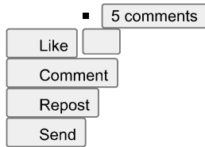

●Feed post number 43

can Rogoff-Following Founder@ The Build Room. Ex-Apple, PlayStation, Nissan. 3w  $\bullet$ ⑤

...

spent 3 days building a memory layer for Claude that never resets.

Most people are using AI like a faster typewriter. They prompt, they copy paste, they save 20 minutes, then start from zero again tomorrow.

That is not a system. That is a habit with extra steps.

Claude is powerful. But by default it wakes up dumb every session. No memory of your clients. No memory of your workflows. No memory of anything.

This guide fixes that.

Here is what is inside:

> The exact four-layer local stack that gives Claude persistent memory

> How to connect it using MCP so it actually holds context across sessions

> The three prompts that activate memory and make it useful from day one

> What to actually store so Claude knows your business, not just your last question

> A step-by-step setup walkthrough with no coding experience required

> How this runs inside the same pipeline I use with 6 AI sub-agents at$5/day

> The shift that happened once my AI stopped starting over every single time

 I went from 0 to 200K+ followers and$250K+ in revenue from content.

This memory stack is part of how I run the whole thing without hiring a team.

Comment"MEMORY" and I'll send it over.

PS- Every session you start from zero is a session your AI could have spent knowing your business. You are already paying that cost. You are just not getting anything for it.

Claude forgets you Fix it.$5/day.

Give Claude a Memory That Never Resets

The exact local MCP stack I use so Claude remembers every client, workflow, and context-39ms retrieval,zero cloud dependency.

How to Use This Guide

This is not a theory document. It is the exact architecture I built and run every day. Read it once straight through. Then go back section by section and build as you read. By the end you will have a Claude that remembers your clients. your voice, your workflows, and your past conversations- permanently.

Here is what this guide covers:

.Why Claude forgets everything and why that is costing you hours every week

.The four-layer local stack that gives Claude persistent memory in under two hours

.How I get 39ms retrieval with zero cloud dependency and zero extra spend

.The exact MCP config tile l use-copy and paste it directly

.Three prompts that tell Claude exactly how to write to and read from its own memory

 I built this after running my full content pipeline-200K+ followers,$250K+ in content revenue-on$5 per day in Al tooling. Efficiency is not optional. This is how I run Claude without wasting a single token re-explaining context.

If you want the full Al content system- not just memory, but 6 sub-agents running your entire pipeline-built The Build Room for exactly this.

Join The Build Room($97/month) at skool.com/buildroom

Claude Wakes Up Dumb Every Session

Media Media is loading

Loaded: 60.61

Stream TypeLIVE

 Remaining time-0:06

1

$$\circ 0.5\times$$

o.75

1x, selected

 o 1.25x

1.5x

1.75x

 o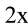

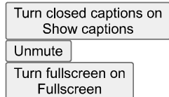

Media player modal window

 Media Attachment

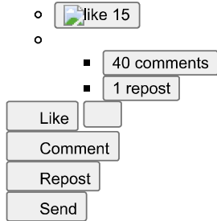

• Feed post number 44

 Rogoff·Following Fo

body outside your network knows you exist.

That's not a skill problem. It's a visibility problem.

I know because I was there.

200+ connections. Every post seen by the same 30 people. I was writing good content into a vacuum and couldn't figure out why nothing was growing.

The change wasn't better content.

It was this: stop creating for your peers. Start creating for the person who was you 12 months ago.

That person doesn't follow you yet. They don't know you exist. But they have exactly the problem you solved.

Write for them. Every time.

I went from invisible to 200,000+ followers with that one shift. Not because I got better at writing. Because I finally understood who I was writing for.

2,000+ builders are making the same shift inside The Build Room.

Comment"VISIBLE" and I'll send you the link.

PS- You'll post again this week no matter what. The question is whether it reaches strangers or the same 30 people.

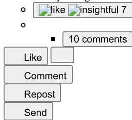

• Feed post number 45

Rogoff Following Founder@ The Build Room. Ex-Apple, PlayStation, Nissan. 4w  $\bullet$ 

I built a content pipeline with 6 AI agents that runs 24/7.

No editing. No manual steps. Zero hours of my time per week.

The part most people miss: the agents remember everything.

Client context. Brand voice. What worked last week. What didn't.

If you're starting from scratch every conversation, you're not running an AI system. You're running a very expensive notepad.

That's the gap I see with most business owners using AI right now.

They're using Claude like a faster typewriter. Prompt in. Copy out. Back to doing it manually tomorrow.

The fix isn't a better prompt. It's memory.

I put together a free guide called The AI Memory Stack.

It covers the 5 memory types that actually matter for client-facing automations.

Here's what's inside:

→Conversation Buffer-how to keep context alive across long sessions without losing the thread

→Entity Memory-teach your agent to remember specific clients, preferences, and business rules automatically

→Episodic Memory-let your agent learn from past interactions so it gets sharper over time

→Semantic/ Vector Memory-store and retrieve knowledge at scale without hitting context limits

→Procedural Memory-lock in your workflows so agents follow your exact process every time

→When to use each type and when not to

→How the full stack connects so your system compounds instead of resets

→Runnable notebooks so you can implement this today, not just read about it

→No coding background required

→Built from the same system that generated 6,800+ leads in 60 days

 Most people lose 15 to 20 hours a week on tasks their agents should already know how to handle.

That's not an AI problem. That's a memory problem.

Comment"MEMORY" and I'll send it over.

PS- One of two things happens after reading this. You close it and keep starting from scratch every session. Or you build the stack once and your agents finally remember who they're working for.

Agents forget nothin 6,800 leads.60 days

The Al Memory Stack

ory types that make your Claude agents remember everything-so you stop rebuilding context oncall.

Why Your Al Agent Keeps Forgetting Everything

Here is what used to happen inside my Al pipeline. I would build a client-facing agent, hand it a 2,000-word context dump at the top of every conversation, and watch it forget all of it the moment the session ended. Next call: start over. Same questions. Same setup. Same waste of time.

I was running 6 Al sub-agents across my content operation and spending 80% of each session just re-orienting the agent on who the client was, what we had already covered, and what decisions had already been made.That is not automation. That is a very expensive to-do list.

The fix was not a better prompt. It was memory architecture. Once I wired in the right memory types for each job,my agents started picking up exactly where they left off. Client context carried over. Decisions stuck.The same$5/day Al stack started doing work that used to take me 67 hours a week.

This guide shows you exactly what I built. Five memory types, how they work, when to use each one, and the exact prompts I use to activate them inside Claude. No theory. No textbook definitions. Just the architecture I run on real client work today.

How to Use This Guide

. Read the five memory my types in order-each one builds on the last.

● Copy the prompts in the gray boxes directly into your Claude workflow.

● Start with with Memory Type 1 today-you can implement it in under 20 minutes.

. Use the comparison table at the end to pick which type fits each use case.

Play

 Media is loading

:60.61%

Stream Type LIVE

 Remaining time-0:06

Playback speed Playback speed

 o 0.5x

$$\begin{array}{l}\text{o 0.75x}\\ \end{array}$$

1.25x

1.5x

1.75x

2x

 closed captions on

 Show captions Unmute mute

 Furn fullscreen on Fullscreen

 M Media player modal window

 M Attachment

 like

17 comments

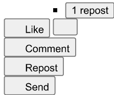

. Feed post number 46

ncan Rogoff•Following Fou Apple,PlayStation,Nissan.4w  $\bullet$ ⑤...

My AI tooling costs less than$3.50/day.

Most people building with Claude are quietly burning 3x that.

Not because they're doing big things. Because their prompts are fat.

Most people are using AI like a faster typewriter. Prompt in. Copy out. Repeat. Nobody's trimming the dead weight.

I cut 80% of my research time using AI. Not by adding more tools. By stripping inputs down to what actually matters.

Fat prompts slow your automations, spike your costs, and hit rate limits faster.

Here's what's inside:

 $\rightarrow$  How I identified the exact tokens wasting money in every Claude input

→The Cut List-every prompt element you can remove without losing output quality

 $\rightarrow$  How to build a System Prompt Architecture that runs lean from the start

 $\rightarrow$  Why prompts get fat in the first place(and the 3 culprits that cost the most)

 $\rightarrow$  The Automation Checklist I run before any workflow goes live

 $\rightarrow$  Mistakes that quietly double your token count every single day

 How to hit 70% lower input costs without changing what Claude outputs

 This is the system behind keeping AI tooling under$3.50/day across a full content and research operation.

Comment"TOKENS" and I'll send it over.

Cut Your Claude Costs 70% Today

The exact token-trimming system I use to run 6 Al agents for$5/day-no quality loss, no prompt rewrites from scratch.

What This Is and How to Use It

sub-agents that handle my entire content pipeline.Research,hooks,drafts,repurposing,scheduling,analytics. All of it. My total Al tooling cost is$5 a day.

That number shocks people.They assume a system that generatestem that generates$250K+ in content revenue must cost a fortune to run. It doesn't. The reason it's cheap is not because I use cheap models. I use Claude Sonnet andOpus regularly.The reason it's cheap is because I stopped sending fat, sloppy prompts.

Most people waste 40 towaste 40 to 70 percent of their input tokens on words that do nothing. Filler instructions.Redundant context. Role-play preambles. Polite throat-clearing. Claude doesn't need any of it. You're paying for every token you send-including the useless ones.

ste audit prompts so you can clean up your existing prompts today. Work thro ugh it top to bottom. Each section takes under 10 minutesapply.

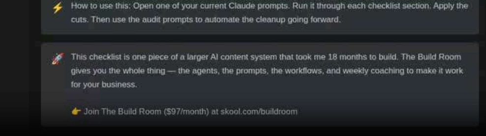

Play

Media is loading

$$\text{Loaded:} 60.61\%$$

0:00

Stream Type LIVE

 maining time-0:06

0.5x

0.75x

。1x.selected

 o 1.25x

1.5x

 o 1.75x

2x

 Turncaptions on

Media player modal window

 Media Attachment

 $\circ$ like insightful 12

$$\begin{array}{l}\\ \\ \\ \end{array}$$

15 comments

• Feed post number 47

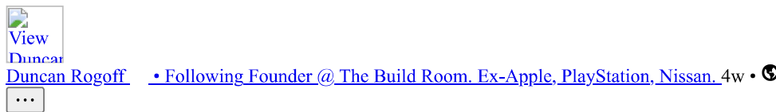

grew from 1,500 to 13,000+ LinkedIn followers in under 12 months.

Zero cold outreach. All inbound.

Most people are still waiting for enterprise clients to find them. They hate the cold DMs that feel spammy. They hate feeling like just another person trying to make a quick buck.

There's a better way.

Anthropic just signaled a massive shift toward enterprise AI services. And solo operators who reposition now will be the ones enterprise buyers call first.

I put together a free guide called The Enterprise AI Opportunity.

It shows you exactly how to reframe your services around AI delivery-so enterprise-grade clients come to you from content alone.

I run 6 AI sub-agents that handle my full content pipeline with zero manual steps. And this guide is built on the same positioning that made that visible to the right buyers.

Here's what's inside:

→How I spotted the Anthropic enterprise signal before it went mainstream

→What the signal actually means for solo operators right now

→How to reposition your existing services for enterprise AI buyers

→The content strategy that attracts enterprise clients without cold outreach

→What to actually offer enterprise buyers(and how to price it)

→How I cut research time by 80% using AI-and made that a sellable outcome

→Your 30-day execution plan to land your first enterprise-level lead

 You don't need a big team. You don't need a big audience.

You need to be positioned correctly before the window closes.

Comment"ENTERPRISE" and I'll send it over.

The Enterprise Al Opportunity

o operators are landing enterprise-grade clients from content aione-no cold outreach, no agency

Read This First

ackstone, Hellman and Friedman, and Goldman Sachs just backed a new enterprise Al services companymovingward Al delivery as a professional service.

solo operators and small business owners will read that headline and think it has nothing to do with them.That is themistake.

e same shift that is attracting billion-dollar capital to enterprise Al services is creating a wide-open lane for operatorsto position themselves correctly. Enterprise buyers need Al delivery help now.They cannot18 monthfor a big firm to staff a project.They need someone who can move fast, thinks inspeaks their language.

That person can beyou. But only if your positioning says so.

This guide shows you the exact repositioning moves that turn a general services offer into an enterprise Al offer-andthat positioning visible through content so the right clients find you first. Use the copy-paste prompts insideeach section to build your repositioned messaging today.

Play

Media is loading

 Play Play

 Loaded: 60.61%

0:00

StreamLIVE

 Remaining time-0:06

1x

$$\begin{array}{l}{}\\ {}\\ {}\\ {}\\ {}\\ {}\\ {}\\ {}\\ {}\\ {}\\ \end{array}$$

o 0.75x

 o 1x, selected

 o 1.25x

 o 1.5x

 o 1.75x

 o 2x

 Turn closed captions on

 Unmute

 Turn fullscreen on Fullscreen

 Media player modal window

 Media Attachment

 o like

48 comments

• Feed post number 59

can Rogoff PlayStation, Nissan. 1mo•

...

I went from"where did my budget go" to zero surprise charges in 11 days.

Claude Code is powerful. It's also quietly expensive if you don't know where to look.

I built a full billing audit after watching$5/day in AI tooling creep past what it should have been. Found 9 traps. Most people hit at least 4 without knowing it.

Here's what's inside:

→How to spot the hidden usage triggers that run in the background without you starting them

→The 9 billing traps draining Claude Code budgets right now-and the step-by-step fix for each one

→How to audit your account settings before they quietly compound into real money

→A quick-reference table so you can run the full check in under 10 minutes

→The exact before/after state so you know what"fixed" actually looks like

→A Master Audit Prompt you can run inside Claude Code to surface the issues yourself

→How to set guardrails so this never happens to you again

 This is not theory. It's a working checklist I built from running 6 AI sub-agents on a$5/day budget.

Every dollar matters when you're running lean.

Comment"AUDIT" and I'll send it over.

From surprise bills to$0 wa 9 traps. Fixed in 11 days.

Claude Code Billing Traps: Full Audit

e exact checklist to find and fix hidden Claude Code charges before they quietly drain your account.

Why This Checklist Exists

A developer on Reddit woke up to a$200 Claude Code bill they never saw coming. The culprit was a single string-HERMES.md-buried in their git commit history. It silently rerouted their billing to a higher usage tier.They had no idea it was happening.

That is not a freak accident. Claude Code has at least 9 documented billing triggers that most users never audit. Some are config settings. Some are git artifacts. Some are default behaviors that Anthropic enabled without a loud warning.

I run 6 Al sub-agents across my full content pipeline for$5 a day total. That number only works because I audited every cost lever before I scaled. One overlooked config file could have pushed that to$50 a day without a single extra output to show for it.

This checklist covers the 9 most expensive billing traps in Claude Code right now. For each one you get: what triggers it,how to check if it is active,and the exact fix.Run this once.Save it.Share it with anyone on your team touching Claude Code.

How to Use This Document

1. Read each trap. Understand what triggers it.

2. Run the audit command or check listed for that trap.

3. Apply the fix if the trigger is active.

4. Check the box. Move to the next trap.

5. Do this before you scale any Claude Code workflow.

Play

 Media is loading

 Play Play

 Loaded:60.61%

0:00

Stream Type LIVE

 Remaining time-0:06

1x

 Playback speed Playback speed

 o 0.5x

 o 0.75x

 o 1x, selected

 o 1.25x

 o 1.5x

 o 1.75x

 o 2x

 Turn closed captions on Show captions

 Unmute

 Turn fullscreen on Fullscreen

 Media player modal window

 Media Attachment

 o like$$\begin{array}{l}\\ \\ \\ \\ \\ \end{array}$$

14 comments

• Feed post number 60

car can Rogoff-Following Founder@ The Build Room. Ex-Apple, PlayStation, Nissan. 1mo•⑤

One year ago I got fired.

Since then, they fired their entire marketing department. Story time

I spent 15+ years in art direction and motion graphics. The reason I was let go:"not enough motion graphics work."

Fair enough. I saw it coming.

What I didn't see coming was what the next year would look like.

In the months before I left, I noticed a large gap in the company's business and an opportunity for me: the company had an existing YouTube channel, but it wasn't being nurtured.

SO, I built a YouTube strategy for the company from scratch.

-Full content plan+ analysis.

- Designpackaging, titles, thumbnails.

-Managed the copywriters, editor, on-camera talent, producers.$$\text{ed the copywriters, editor, on-camera talent, producers.}$$

Right before production, the channel was handed to someone else.

Because this person sat on the"content team" who owned the channel while I sat on"creative." Never mind we worked for the same company...

Their content team was running the LinkedIn too. Posting a couple times a week for a handful of likes, mostly from other employees. That's not a strategy. That's a company talking to itself.

One year later, my numbers:

→Almost 60,000 YouTube subscribers

 $\rightarrow$  13,000 LinkedIn followers(from 1,500)

→Nearly 200,000 followers across channels

→Multi-billion dollar clients signed to my agency

→Multiple six figures in revenue

→Thousands of inbound leads from content alone

 Their numbers:

40 people fired. CMO all the way down.

The content machine they wouldn't let me run, I built for myself.

Here's what I think is actually happening at most companies:

Creative results are hard to quantify.

Everyone knows great design converts.

Everyone knows strong branded content matters.

But you can't put a clean number on it, which means it's hard to justify a promotion, hard to make the case for your own value.

So creative talent gets pigeonholed instead of promoted. Kept in a lane because the lane is measurable in deliverables.

Our team touched every vertical.

Built the websites, ran the ads, owned the social.Everything.

But none of it fit neatly into a metric, so none of it counted.

If you have someone on your team who is hungry, stepping outside their role, raising their hand, wanting more, let them run.

 $\circ$ like celebrate support 66

 $\circ$ 25 comments

. Feed post number 79

Rogoff-Following Founder@ The Build Room. Ex-Apple, PlayStation, Nissan. 1mo⑤...6 hours a day.

That's how much time the average business owner wastes on tasks AI could handle right now.

I built a checklist that finds exactly which tasks those are in your business.

It took me 80% less time to research and build once I ran my own version.

The result: 10+ hours back every week.

Not from working less. From stopping the wrong work.

Here's what's inside:

 $\rightarrow$  A full task dump exercise to surface every time-draining job you do

 $\rightarrow$  A scoring system that ranks which tasks to automate first

 $\rightarrow$  Step-by-step instructions to automate your top 3 tasks today

 $\rightarrow$  A calculator that shows exactly how many hours you reclaim

 $\rightarrow$  A roadmap for what to build next once the first wins stack up

 One business owner used this to reclaim 12 hours in week one.

That's 12 hours redirected to the work that actually closes clients.

Comment"AUDIT" and I'll send it over.

Stop losing 6hrs a day 10+ hours back.Free.

The Job Automation Audit

Find the 10+ hours hiding in your workweek and hand them off to Al- so you only touch the work that actually grows revenue.

Read This First

Two years ago I was doing everything myself. Research, writing, scheduling, inbox management, reporting-all of it. I was working 50-hour weeks and barely breaking even on the things that actually mattered. Revenue was stuck. Growth was stuck. I was the bottleneck.

Then I started auditing my time like a ruthless accountant. Task by task. Hour by hour. I asked one questionabout everything I did: does a human need to do this, or can a machine do it better and faster?

answer was uncomfortable. More than 60% of what I was doing every day required zero human judgment.required time.Time I was trading for tasks that a$5/day Al stack could handle permanently.

6 Al sub-agents to run my content pipeline. I cut my research time by 80%. I went from 0 to 110K+owers across channels in under 12 months and generated$150K+ in revenue directly from content-whilestack ran most of the operation.

audit is the exact process I used. It takes about 20 minutes to complete. When you are done, you will have ked list of tasks to automate, the prompts to start automating them today, and a clear picture of how manyhours you are leaving on the table every single week.

How to Use This Document

1. Work through Part 1 first. Dump every repeating task you do in a week onto the audit table. Do not filter yet-just list.

2. Score each task using the three criteria in Part 2. This tells you what to automate first.

3. Use the copy-paste prompts in Part 3 to start handing off your top 3 tasks to Al today.

Play

 Media Media is loading

 Lo$$\text{Loaded:} 50.25\%$$

0:00

Stream Type LIVE

 Remaining time-0:07

1x

 Playback speed Playback speed

 o 0.5x

 o 0.75x

 o 1x, selected

 o 1.25x

 o 1.5x

 o 1.75x

 o 2x

 Turn closed captions on

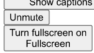

 Media player modal window

 Media Attachment

 o like

8 comments

• Feed post number 80

ncan Rogoff-Following Founder@ The Build Room. Ex-Apple, PlayStation, Nissan. 1mo•

I went from$0 to$150K+ in revenue using content I almost deleted.

Most of it started as assets I already had.

Here's what I mean.

Old lead magnets. Dusty proposals. Abandoned funnels. They're sitting in your Google Drive doing nothing right now.

I used Claude Code to resurrect them into active revenue systems. The whole process took one weekend. It cut my research and rebuild time by 80%.

So I packaged the exact framework into a free playbook.

Here's what's inside:

→The Asset Audit: find everything worth reviving in under an hour

→The Revival Rewrite: exact Claude Code prompts to rebuild dead assets fast

→The Reactivation Email: send one email and reactivate cold leads immediately

→Priority order: which assets to revive first for fastest revenue

→Before/after examples of real assets that got rebuilt

→The full weekend workflow from audit to live system

 You already did the hard work once. This playbook makes it pay twice.

Comment"REVIVE" and I'll send it over.

Your dead assets= money

One weekend. Real revenue.

The Dead Asset Resurrection Playbook

How to use Claude Code to turn forgotten files, dusty funnels, and abandoned lead magnets into activeweekend.

Before You Read This

You have dead assets. Every business owner does. A lead magnet you built 18 months ago and never promoted.A proposal template that closed 3 deals then got buried in a folder. A nurture sequence you wrote

 scheduled once, and forgot. A funnel you paid someone$4,000 to build that never got traffic.

None of that is dead. It is dormant. There is a difference.

Dead means no value left. Dormant means the value is there but nothing is activating it. That is exactly the problem Claude Code solves.

This playbook walks you through the exact process I use to audit, revive, and redeploy old business assets using Claude Code. No developers. No agencies. No starting from scratch. You feed Claude the old files and a set of exact prompts, and it rebuilds everything into something that runs.

How to use this; Read it top to bottom once.Then come back to each section with your actual files open.The prompts are copy-paste ready.The workflow is sequential, Do not skip steps.

This playbook works best on: old lead magnets, dead email sequences, unused proposal templates,abandoned landing pages, and any funnel you built but never finished. If it has words and structure, Claude can work with it.

Want the full Al content system that builds your pipeline while you sleep? This playbook is one piece of it.The Build Room is where you get the rest-including done-for-you lead assets, weekly live coaching, and

 Play

 Mloading

 Play Play

50.51%

0:00

Stream Type LIVE

x

0.5x

0.75x

1x, selected

1.25x

1.5x

1.75x

2x

 rn closed captions on Show captions

 mute

 run fullscreen on Fullscreen

 Media player modal window

 Attachment

 $\circ$ like

comments

·Following Founder@

 $\cdots$ 

Day 11 of building a$1M personal brand with AI.

Google launched Nano Banana 2 on February 26. Within hours it was\#1 on the Artificial Analysis Image Arena, a blind human evaluation leaderboard, at roughly$$\text{ half the price of its predecessor.}$$

For creators, here's what actually changed: readable text in images, character consistency across 5 images, 4K output, 2-5x faster generation, and real-world knowledge via Google Search.

I put together 20 prompts organized by use case.

If you want access to everything I build, including all 20 prompts from this video, that's in The Build Room, link in bio.

hashtag#AIAutomation hashtag#PersonalBrand hashtag#BuildInPublic

Customize layout

20 Nano Banana 2 Prompts You Need to Start Using Immediately

 Date

 February 28,2026 6:29 PM

6 more properties

mments

nt...

20 Nano Banana 2 Prompts Youart Using Immediately

Copy-paste prompts for portraits, charactersthe#1-ranked image model on the plane

sed on 0→110K followers in uno

20 NANO BANANA

Media Media is loading

Loaded: 27.46%

$$\text{Stream Type LIVE}$$

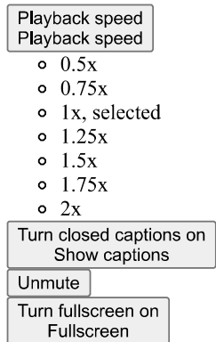

Media player modal window

 Media Attachment

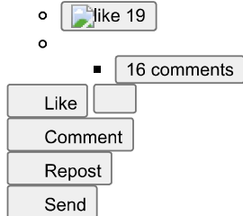

• Feed post number 100

 Rogoff$$\text{. Following Founder@ The Build Room. Ex-Apple, PlayStation, Nissan. 3mo}\bullet$$⑤...10,0000 LinkedIn Followers! What does it mean?!

I started being intentional about posting consistently around mid-year 2025.

The chart below is what that looks like.

When you look at this chart, what's your takeaway?

For your own growth. For what's possible. For what it actually takes.

Drop it below or share one thing you've learned from your own journey.

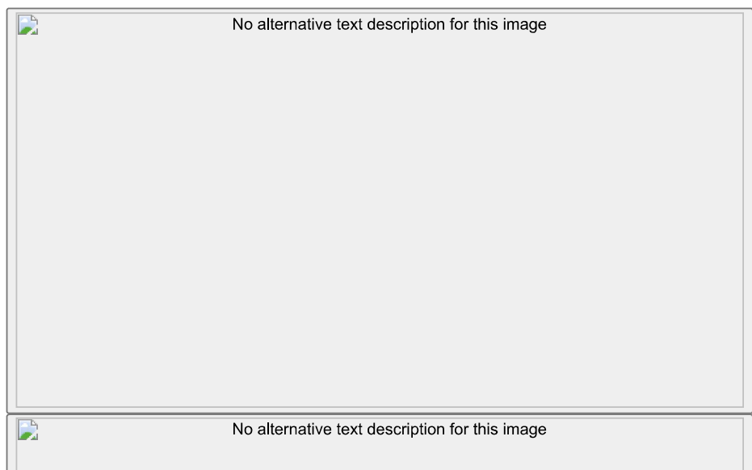

Activate to view larger image,

$$\begin{align*}&\text{o}\\ &\end{align*}$$

4 commen

• Feed post number 119

 Duncan Rogoff●Following Founder@ The Build Room. Ex-Apple, PlayStation, Nissan. 3mo•

Day 3 of documenting the path to$1M personal brand with AI.

Today I'm giving you an app that clones any creator's best content packaging in 60 seconds.

Here's what it does:

You plug in the YouTube channel IDs of creators you follow. It pulls every video they've ever posted. Then it rewrites their best performing titles for your niche.

But here's where it gets interesting: you upload a photo of your face and it swaps you into their thumbnail layouts. Their proven, viral thumbnail layoutswith your

face.

You're not guessing what works anymore. You're just taking what already works and making it yours.

Inside The Build Room, you get the master prompt to build this instantly, plus all the code files. Everything I build, you get The Build Room, link in bio.

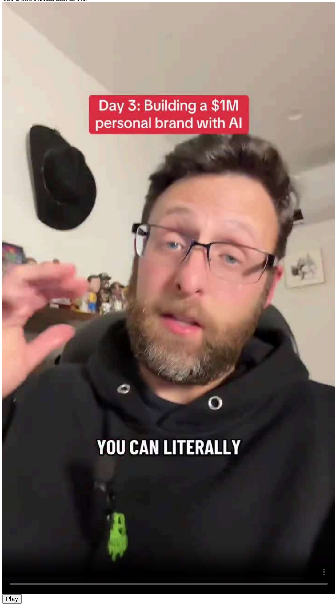

$$\text{d:} 11.39\%$$

Stream Type LIVE

Remaining time-0:35

$$\begin{array}{l}\text{o} 0.5 x\\ \text{o} 0.75 x\\ \end{array}$$

o 0.75x

1x, selected

 o 1.25x

1.5x

1.75x

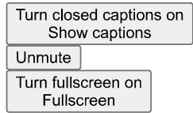

Media player modal window

 Media player modal window This modal can be closed by pressing the Escape key or activating the close button.

Close modal window

 Media Attachment

 o like love insightful 19 o

3 comments

 Like

 Comment

 Repost

 Send

● Feed post number 120

Rogoff·Following Founder@The Build Ro om. Ex-Apple.....................................................................................................

...

$$\text{Code}\text{just made building} n8 n\text{workflows embarrassingly simple}.$$

Most builders are still grinding through tutorials. There's a faster way and it requires zero n8n knowledge.

Most tutorials give you the happy path.

→$$\begin{align*}&\text{Form}\rightarrow\text{Slack}.\end{align*}$$

→Email.

Simple stuff that breaks the second you hit production.

Pro Production has API downtime.

Rate.........limits.

Bad data.

ge cases you didn't think about.

I've built 37 workflows that handle everything from lead enrichment to a$20K/mo insurance automation pipeline.

Every single one includes fallback logic, error handling, and logging.

Because the thing that makes workflows production-ready isn't complexity.

It's boring reliability.

I documented the 10 prompts I actually use with Claude Code's n8n MCP.

Each one includes:

→When to use MCP vs manual

→The exact prompt that works

→Production tips from real deployments

 Error handling that prevents failures

Lead enrichment with Clearbit/Apollo fallbacks.

Content publishing with image CDN handling.

Payment reminders that check metadata before auto-suspending.

Error monitoring that auto-recovers before you even notice.

Not theory.

Actual workflows running in production.

The MCP can generate all of this if you prompt it correctly.

Specific requirements.

Error cases.

Success criteria.

That's what separates 15 minutes from 2 hours.

Like+ Comment"BUILD" and connect with me.

I'll send you the exact Claude Code setup prompts.

(Must be connected)

10 n8n MCP Prompts That Actually...

10 n8n MCP Prompts That Actually Work in Production

√6 more properties

 Comments

 Add a comment...

*Stop copying tutorials. Start building workflows that scale.*

37 workflows in production|$100K+/yr agency| 8-15 minutes vs 2-4 hours

 I've built 37 production n8n workflows using Claude Code's n8n MCP. They handle everything from lead enrichment to$20K/mo insurance automation. The difference between a tutorial workflow and production? About 2 hours of error handling, edge cases, and deployment headaches.

Here's the thing nobody tells you: the MCP isn't magic. It's a tool. You need to know when to use

 Play

 Media is loading

 Play Play

 Loaded: 71.86%

0:00

Stream Type LIVE

 Remaining time-0:05

1x

 Playback speed Playback speed

 o 0.5x

 o 0.75x

 o 1x, selected

 o 1.25x

 o 1.5x

 o 1.75x

 o 2x

 Turn closed captions on Show captions

 Unmute

Media player modal window

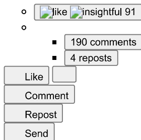

• Feed post number 139

View

Duncar

 Duncan Rogoff- Following Founder@ The Build Room. Ex-Apple, PlayStation, Nissan. 4mo  $\bullet$  Edited  $\bullet$ 

...

you want MRR, you need to read this.

This might be your last chance to get into the Business Builders Club FOR FREE.

.Top\#25 on Skool in 25 days.

.$70M+ GMV.

Now he's giving away 100% commissions for 60 days.

@davidiya just announced he's closing the free window for the Business Builders Club soon.

Yes!(the one who hit Top#25 on Skool in 25 days) and he's opening up his playbook and more.

He's sharing everything:

→Growth strategies

→Engagement tactics

→1000+ automation templates

 and so many more ideas to help people build and scale their businesses or Skool communities.

Like I've said in the past

 My boy is a Forbes 30 Under 30, YCombinator alumni who's built companies across 30+ countries with$70M+ GMV.

He's not just teaching theory, he's sharing the exact playbook he's used himself.

The deal right now:

.You can join for free(but this window is closing soon)

55% off his Premium and VIP plans until Saturday which will double soon

.100% affiliate commissions for 60 days.

He's literally giving 100% commissions to his members

This isn't another ghost town Skool.

It's full of builders helping builders.

Real engagement, weekly calls, and a community that actually shows up.

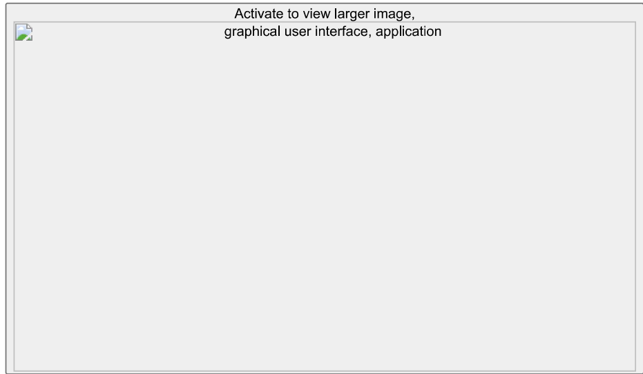

Activate to view larger image,

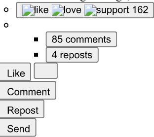

· Feed post number 159

ncan Rogoff $\cdot$  Following Founder  $@$  The Build Room. Ex-Apple, PlayStation, Nissan. 5mo  $\cdot$  Edited  $\cdot$ ④

...

Most engineers think AI automation means replacing humans, but the real game is building systems that make your team 10x more effective at solving problems nobody else can.

I've watched companies waste millions on"AI solutions" that automate the wrong things.

The winners? They automate the noise so their people can focus on the signal.

Stop chasing shiny tools. Start building leverage.

Act to view larger image,

$$\begin{array}{c}\text{o}\\ \text{like}\\ \text{insightful}\\ \text{love}\,21\end{array}$$

Like Comment Repost

 Send

• Feed post number 160

Duncar

 Duncar Duncan Rogoff-Following Founder@ The Build Room. Ex-Apple, PlayStation, Nissan. 5mo-Edited-⑤

n8n 2.0 just dropped and nobody's talking about the real win.

Everyone's hyped about the UI refresh.

Cool. But here's what actually matters:

The security overhaul.

know. Not sexy. But listen.

I just migrated 3 client workflows yesterday.

The new permission system means their customer data is actually isolated now.

Before? One compromised credential could expose everything.

Now? Role-based access down to the node level.

Here's what changed that matters:

●Credential scope is workflow-specific(finally)

● Execution logs are encrypted at rest

●API tokens expire automatically

●Environment variables are actually secure

The upgrade path is dead simple:

Settings  $\rightarrow$  Workspace  $\rightarrow$  Version dropdown  $\rightarrow$  2.0(beta until Dec 15th)

Takes 5 minutes.

Zero downtime if you're on cloud.

But here's my advice from migrating 47 workflows this week:

Test your HTTP nodes first.

The authentication flow changed slightly.

Most of mine worked fine. Two needed tweaks.

If you're running n8n for clients, this is your competitive edge.

Nobody else can say"enterprise-grade security" with a straight face yet.

You can.

Like+ Comment'BUILD' to join the community and get my migration checklist for version 2.0.

larger image,

2 co

●Following Founder@ The Build Room. Ex-Apple, PlayStation, Nissan. 5mo  $\bullet$  Edited  $\bullet$ ⑤

I just watched a 3-person agency land a$15K ad retainer.

Their secret? AI video workflows that costs less than$47.

Here's the exact stack they're using:

Step 1: Upload product photo to Google Studio

Ask it to generate a hero character prompt based on your brand

Takes 30 seconds

 Step 2: Drop that prompt into Higgsfield

 Get 10+ character options instantly

 Pick your favorite

 Step 3: Let Google Studio write your entire shot list

 Image prompts

 Camera movements

 Scene descriptions

 Step 4: Copy/paste into Higgsfield for each shot

Download clips

 Edit in CapCut or Premiere

 Total time: 20 minutes for a cinematic ad

 When I first tested this, I thought it would look cheap.

Then I showed my real estate client the output.

They canceled their$8K videographer contract.

The bottleneck? Switching between tools and reformatting prompts.

So I built an automation that does the research, mood boards, and shot lists in 3 clicks.

No more copy/paste hell.

Same workflow my agency uses for property tour ads.

Like+ Comment'BUILD' to join the community and get the AI ad workflow automation for free.

Activate to view larger image,

Like Comment Repost

 Comment

 Repost Send

. Feed post number 162

Rogoff.FolloPlayStation, Nissan. 5mo  $\bullet$  Edited  $\bullet$ 

...

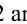s.

The results shocked me.

For the first time, we have native audio in AI video generation. Not slapped on. Actually generated with the lip sync and ambient sound.

I ran the same prompt across all three:

A woman walking through New York, speaking to camera with street noise.

Veo 3.1: Nailed the lip sync. Cars honking. Natural energy. Clean.

Sora 2 Pro: Visually stunning but audio felt disconnected.

Kling 2.6: The dark horse. Matched dialogue perfectly AND generated realistic background noise.

Here's what matters for automation:

If you're building AI video worklvs for clients(real estate tours, product demos, training content), audio generation just became the bottleneck remover.

No more manual voiceover syncing.

No more separate audio tools.

.....................................................................................................

When I started building AI agents, video generation was too janky for production. We'd avoid it.

Now? My agency is testing Kling 2.6 for property walkthrough videos with agent voiceovers. Fully automated.

The workflow is simple. The results are client-ready.

Like and Comment'BUILD' to join the community automating AI video into real client deliverables.

Activate to view larger image,

 $\circ$ like support 17 o

7

1 repost

 Like Comment

 Repost

• Feed post number 163

ngoStation,Nissan.5mo•

…

ents fail because people skip the foundation.

They jump straight to fancy LLMs and wonder why outputs are trash.

Here's what actually works:

Your agent is only as good as its context.

Before you touch ChatGPT or Claude, build this:

-A knowledge base(Google Drive, Notion, whatever)

- Clear SOPs for each task

- Examples of perfect outputs

- Decision trees for edge cases

 Then connect n8n to pull that context dynamically.

I learned this the hard way building agents for real estate teams.

First version? Generic responses. Clients hated it.

Second version? Fed it their actual MLS data, buyer scripts, and objection handlers.

Same LLM. 10x better results.

The model didn't change.

The context did.

Stop throwing prompts at AI and hoping for magic.

Start treating it like an employee who needs proper training.

Your agent should know your business before it talks to your customers.

Like+ Comment'BUILD' to join the community mastering this exact workflow.

Activate to view larger image,

18 comments

2 reposts

 Like Comment

 Repost

 Send

. Feed post number 164

ncan Rogoff$$\text{Station, Nissan. 5mo}\bullet$$⑤

...

2.0 drops soon. I've been testing it. Here's the truth.

This is NOT a revolutionary overhaul.

Your existing workflows? They'll work fine.

Core functionality? Unchanged.

But there ARE 3 improvements worth knowing:

●UI Redesign-Flatter,cleaner nodes. Reorganized sidebar. New loading animations when nodes execute.

●Faster Workflow Access-The sidebar tweak actually saves time when you're debugging complex automations.

.Real-Time Clarity-Loading animations show what's executing. Helpful when demoing to clients or troubleshooting.

Bottom line: Quality of life upgrade, not a capability leap.

When I first started building automations, I chased every shiny update. Wasted weeks migrating for features I never used.

Now? I test first. Ship second.

If you're running client workflows or scaling your own operations, n8n 2.0 won't break anything. But the UI polish makes demos cleaner and debugging faster.

$$\text{ That's enough for me.}$$

$$\text{ Like+ Comment'BUILD' to join the community where we're testing these releases together and shipping automation that actually makes money.}$$

Activate to view larger image,

1 repost

 Like Comment Repost

. Feed post number 165

Duncan Rogoff• Following⑤

...

I spent$400 on AI tools last month.$400 on AI tools last month.

Here's what was actually worth it(and what wasn't).

ChatGPT($20/mo): Not worth it.

Worse model than Claude. Worse than Gemini. Image gen is behind. Video gen too restrictive. If you're still using it as your daily driver, you're leaving money on the table.

$$\text{ Claude($100/mo): 100\% worth it.}$$

I'm on the Max plan because I build with Claude Code constantly. Neck-and-neck with Gemini 3 Pro. Best-in-class for technical work. I'll probably jump to the$200/mo 20X plan soon.

Gemini($20/mo): Worth it.

Best image model. Best video model. If you're not coding daily and don't need Opus-level power, this should be your go-to over ChatGPT.

n8n($5/mo self-hosted,$20 cloud): Worth it.

Best low-code automation tool. Period. This is how we build agent workflows that actually ship.

Lovable($20/mo grandfathered): Not worth it anymore.

Used to be a steal. Now it's$40/mo for new users and you can replicate the same output with Claude+ Cursor for less.

When I started my agency, I wasted thousands testing every shiny tool. Now I only pay for what moves the needle. These 5 are my entire stack.

Like+ Comment'BUILD' to join the community and see how we're using these tools to automate real businesses.

Activate to view larger image,

like insightful 55\(\begin{align*}\begin{aligned} C&=1,2,3,4,3,4,3,4,3,4,3,4,3,4,4,3,4,

55 comments

3 reposts

 Like Comment

 Repost

- Feed post number 166

ncan Rogoff· Following Founder@ The PlayStation,Nissan.5mo•⑤

 $\cdots$ 

Learn to create cinematic AI ads with Nano Banana Pro.

This type of creative AI work gets you clients and gets you paid.

While everyone's fighting over ChatGPT prompts, smart creators are building actual revenue-generating systems.

Here's what most people miss:

AI isn't just about efficiency anymore.

It's about creating Hollywood-level content that used to cost$50K+ and delivering it for a fraction of the price.

Nano Banana Pro lets you turn simple product shots into scroll-stopping video ads that convert.

The same ads that agencies charge$5K-$15K for.

I'm watching creators who mastered this tool land$3K-$8K clients consistently.

Not by being the cheapest.

By delivering results that look expensive.

The gap between"AI user" and"AI professional" isn't technical knowledge-it's knowing which tools create client-ready outputs.

Most AI tools are party tricks.

Google's Nano Banana Pro is a business asset.

Want to see how this actually works in practice?

Comment"NANO" and I'll send you:

1) a full video breakdown

2) a link to a FREE TOOL I developed to reduce creation time by 90%

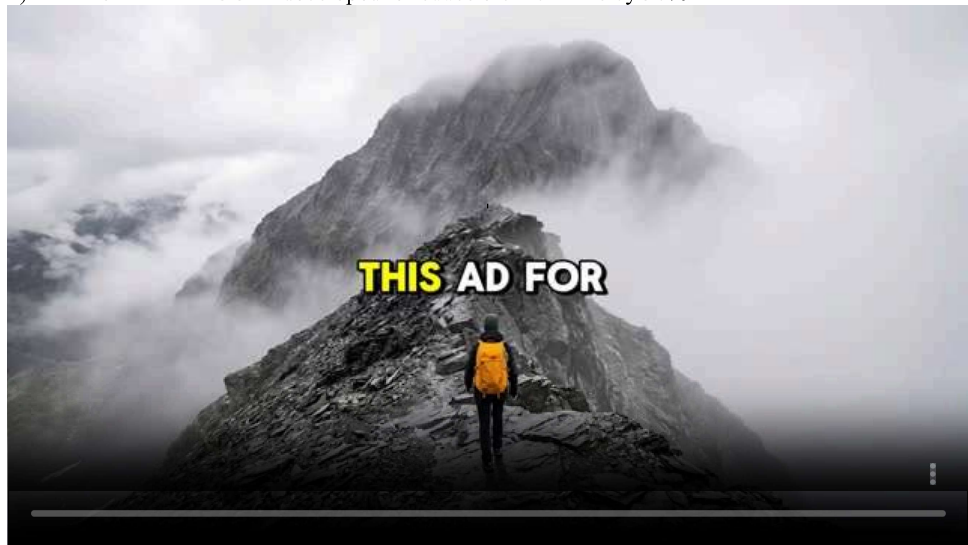

is is loading

Play

 Loaded: 5.30%

0:00

Stream Type LIVE

Remaining time-1:15

1x

 PlaPla

o 0.75x

1x, selected

1.25x

1.5x

1.75x

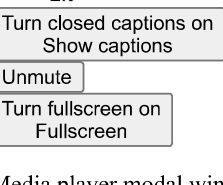

Media player modal window This modal can be closed by pressing the Escape key or activating the close button.

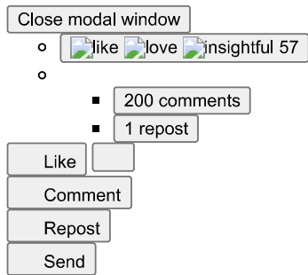

.Feed post number 177

Duncar Duncan Rogoff Following Founder@ The Build Room. Ex-Apple, PlayStation, Nissan. 6mo  $\bullet$  Edited  $\bullet$ 

...

47 viral video ideas in 4 minutes. 100% automated.

Complete production briefs. Hooks. Scripts. Shot lists.

All from comments my audience already left.

I haven't planned content manually in 6 months.

Here's what it does:

Scrapes comments→Analyzes trends with GPT-4o→Creates actionable content briefs→Uploads everything to Notion

 I ran it on 200+ comments across TikTok, YouTube, and Reddit.

The output:

●Trend analysis showing what people actually want

5 complete video concepts with production checklists

 Hooks for each video("You don't need 10 clients, you need 1 offer that consistently sells")

.Full narrative beats

.Shot-by-shot breakdowns

.Links to similar performing content

 Your audience is literally telling you what they want in the comments.

This automation just organizes it into a content calendar.

I run this weekly now.

It's like having a content strategist who reads every comment and turns them into a 30-day content plan.

Comment"BUILD" if you want to learn how to build AI automations that eliminate content planning forever.

I'll send you an invite to the private community where I teach founders how to build and sell automations.

Inside you'll get:

.The full step-by-step video showing this automation

.The guide to rebuild it yourself in under an hour

All the free training on packaging it into a$3K-$5K/month offer

Templates, systems, and examples people are using to land clients right now

 You're not just getting a raw workflow file.

You're getting the training hub where I show you how to build this-and every other money-making automation we release.

Comment"BUILD" and I'll get you in.

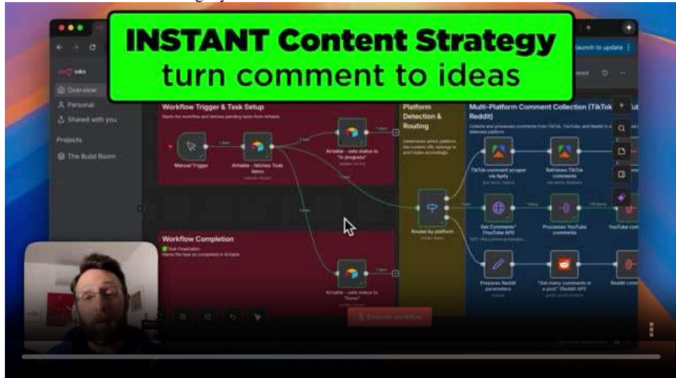

Play

 Media is loading

 Play Play

 Loaded: 53.33%

0:00

Stream Type LIVE

 Remaining time-0:07

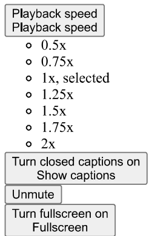

Media player modal window

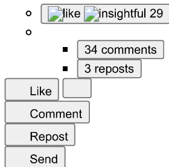

. Feed post number 178

 Rogoff·Following Founder@ The Build Room. Ex-Apple, PlayStation, Nissan. 6mo· Edited·

views in 3 days with AI automation.

It creates viral chiropractor videos using Sora 2, hands-free.

Zero editing.

Zero filming.

Just scheduled content that prints engagement.

Here's how it works:

Schedule trigger→Generates custom prompt→Sends to Sora 2 via Kie.ai→Auto-uploads to Google Drive

 The secret is in the prompt engineering.

Most people just throw random ideas at AI video generators and wonder why nothing sticks.

I built a system prompt that generates consistent viral content:

.Fixed character and setting(brand recognition)

● Predictable setup with absurd payoff(comedy formula)

●Variable action each time(never gets stale)

The AI generates ultra-realistic iPhone footage of a chiropractor doing ridiculous WWE-style moves on patients.

Completely over-the-top.

Obviously comedic.

Massively viral.

A 10-second clip costs$0.15.

One workflow.

Infinite variations.

All automated.

I'm using this same system for multiple content themes.

If you want it, Like+ Comment"BUILD."

I'll send you an invite to the private community where I teach founders how to build AI automations that generate millions of views.

Inside you'll get:

● The full step-by-step video showing this automation

● The guide to rebuild it yourself in under an hour

●All the free training on packaging it into a$3K-$5K/month offer

● Templates, systems, and examples people are using to land clients right now

You're not just getting a raw workflow file.

You're getting the training hub where I show you how to build this-and every other money-making automation we release.

Comment"BUILD" and I'll get you in.

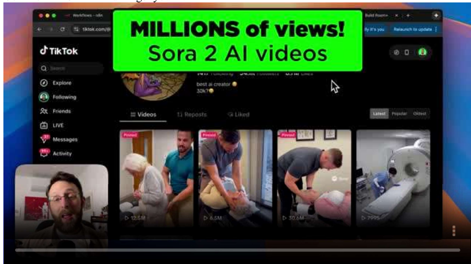

is loading

00%

Stream Type LIVE

maining time-0:08

1x

$$\begin{array}{l}\circ\,0.5x\\ \circ\,0.75x\\ \end{array}$$

0 0.75x

o 1.25x

1.5x

 o 1.75x

 o

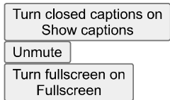

Media player modal window

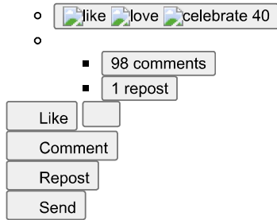

. Feed post number 179

ncan Rogoff·Following Founder@The Build Room.-Apple,PlayStation,Nissan.6mo·Edited⑤

...

Google AI Studio just killed the$40/month AI coding tool.

I tested it against Lovable head-to-head.

Google's new AI Studio lets you build full MVP apps for free

 It connects directly to Imagen 3, Veo 3, and every Google API with 1 click.

I Built the same app twice.

Once in Lovable

 Once in AI Studio

 The app is a virtual try-on tool.

Upload your photo+ clothing and AI generates you wearing it.

Here's what happened:

Google AI Studio:

 $\rightarrow$  Built in 92 seconds

 $\rightarrow 100\%$  free(100 Gemini Pro requests/day)

 $\rightarrow$  Auto-connected to Imagen 3 for image generation

 $\rightarrow$  Instant access to Maps, Search, all Google tools

 $\rightarrow$  "I'm Feeling Lucky" button generates app ideas for you

 Lovable:

- Took a couple minutes

$40/month

.Better UI polish out of the box

.More refined starter templates

 The results? Both worked.

Google's felt slightly rougher but the speed+ integrations+ price point(FREE) are insane.

The craziest part:

You can validate entire product ideas before spending a dollar.

Spin up an MVP in 2 minutes  $\rightarrow$  Send to your audience  $\rightarrow$  Get real feedback  $\rightarrow$  Iterate or kill it.

No code.

No commitment.

Just execution.

This is how you test 10 ideas in a weekend instead of overthinking 1 idea for a month.

If you're building AI tools or micro-SaaS, this changes everything.

If you want to build apps like this...

Like+ Comment"BUILD."

I'll send you an invite to the private community where I teach founders how to build and sell automations.

Inside you'll get:

- The full step-by-step video showing this automation

- The guide to rebuild it yourself in under an hour

•All the free training on packaging it into a$3K-$5K/month offer

- Templates, systems, and examples people are using to land clients right now

 You're not just getting a raw workflow file.

You're getting the training hub where I show you how to build this-and every other money-making automation we release.

Comment"BUILD" and I'll get you in.

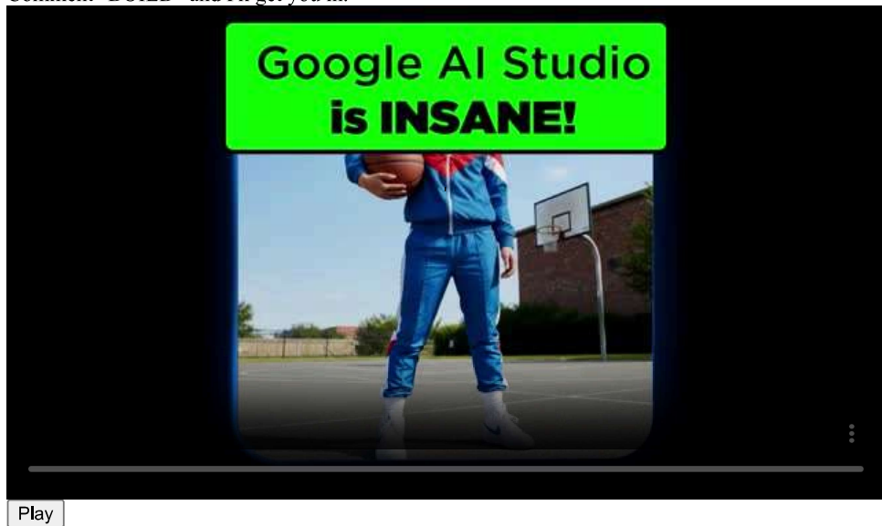

is loading

Loaded:78.43%

Type LIVE

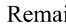maining time-0:05

Pl Playback speed PlaPlayback speed

 o o 0.5x x

0.75x

1x, selected

1.25

1.5x

1.75x

 o

 Turn closed captions onShow captions Unm

Media player modal window

 $\circ$ like insightful love 140 o

■234 comments

■

Like Comment

 Repost

• Feed post number 180

can Rogoff•FolFounder@ The Build Room. Ex-Apple, PlayStation, Nissan. 6mo  $\bullet$ 

......

1 product photo into full UGC+ B-roll ad sequences.

Sora 2 just dropped storyboards.

Here's what happens:

Upload a product image→$$\text{generatesUGC-styleclips+B-roll}\rightarrow\text{Stitchesthem into25-secondads.}$$

No video editor needed.

I tested it with Oatly oat milk.

Uploaded 1 screenshot.

Got back 5 clips perfectly cut together in 4 minutes.

The system:

→Analyzes the image with GPT-4

→Creates scene prompts(UGC shots+product B-roll)

→Generates video via Kie AI($1.35 for 15-25 seconds)

→Auto-saves to Google Drive

 This is a goldmine for e-commerce.

99% of product listings don't have video.

But listings with video get 403% more inquiries.

This solves that in 4 minutes for$1.35.

The workflow is inside The Build Room.

Full n8n setup, all the connections, ready to deploy.

If you want it...

(23) Activity| Duncan Rogoff| LinkedIn

• Feed post number 197

View Duncar

Duncan Rogoff·Following Founder@ The Build Room. Ex-Apple,PlayStation,Nissan.7mo·Edited·⑤

87% of businesses are losing clients.

I just built an AI knowledge base that answers client questions 24/7-in under 10 minutes.

No coding. No complexity. Just pure automation power.

Slow response times are hurting your business.

Here's what changed everything:

Most businesses are sitting on goldmines of information-SOPs, client onboarding docs, product guides-but it's scattered everywhere.

Clients wait hours(or days) for answers.

That frustration costs you deals.

The Solution:

I used Pinecone's Assistant feature+ n8n to create a custom AI brain that:

→Instantly answers ANY question about my business

→Pulls exact information from my documents

→Works 24/7 without me lifting a finger

→Looks professional with a custom front-end

 The Process(Ridiculously Simple):

- Upload your documents to Pinecone

- Connect it to an AI agent in n8n

-Add a beautiful chat interface with Lovable

-Deploy to clients

 The Results:

→Response time: From hours to seconds

→Client satisfaction: Through the roof

→My time saved: 10+ hours per week

→Setup time: Under 10 minutes

 Here's how I supercharged this:

I built a beautiful, professional front-end using Lovable(an AI coding platform) so your clients never touch your automation.

Now you don't have to worry about clients accidentally breaking things.

Just a clean, branded chat interface that makes you look like you spent$10K on custom development.

If you're manually answering the same questions over and over, you're leaving money on the table.

Your knowledge should work FOR you, not trap you in endless DM threads.

This is the exact type of automation that separates six-figure businesses from seven-figure ones.

Want the full step-by-step video guide on building your own AI knowledge base?

Like+ Comment"RAG" below and I'll send it to you.

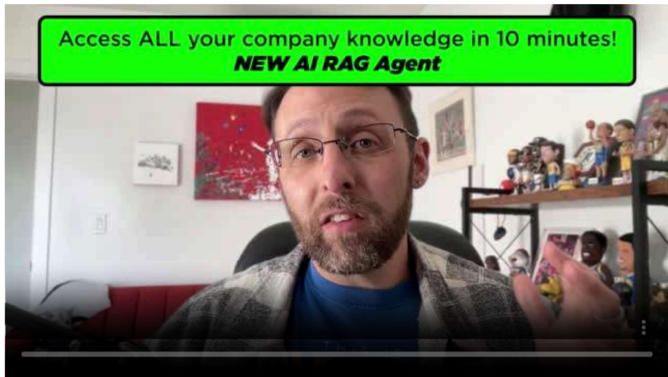

is loading is loading

$$\text{Loaded:}29.20\%$$

Type LIVE

 ing time-0:13

1x

0.75x

1x, selected

1.25x

1.5x

1.75x

2x

 Turn closed captions on Show captions Unmute Turn fullscreen on

Media player modal window

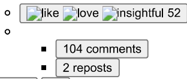

 Like Comment Repost Send

• Feed post number 198

can Rogoff.Following Founder@ The Build Room.Ex-Apple,PlayStation,Nissan.7mo·Edited⑤

...

estate video just changed forever.

We plugged Google Veo 3 into listings- and removed 90% of the friction.

No camera crews.

No editing queues.

No waiting three days for a 60-second clip.

Paste a Zillow URL→get a cinematic video in 4 minutes.

The same technology that powers Hollywood trailers now builds property videos for everyday agents.

And it's 90% cheaper than the old way.

We're not selling AI.

We're selling speed, scale, and leverage.

This is what happens when automation collides with a$500B market still running on photos.

Agents who move first will own the feed.

Like+ Comment"REAL" for beta access.

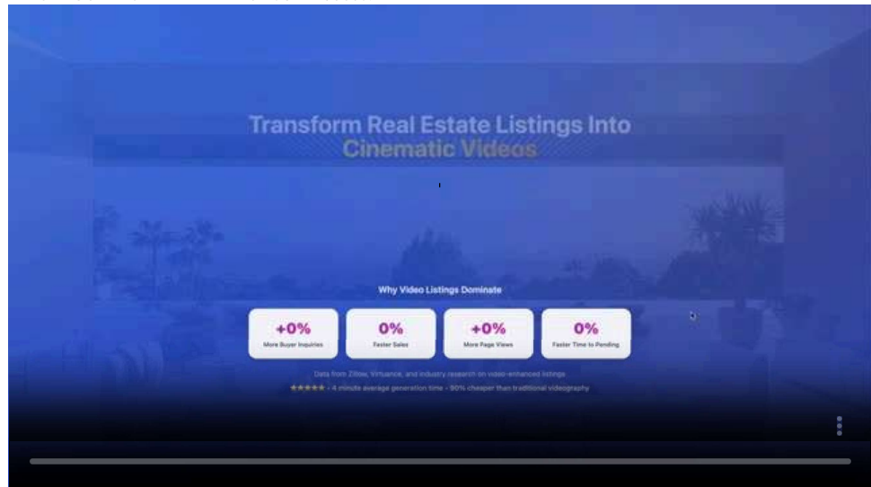

is loading

50.62%

pe LIVE

Remaining time-0:08

1x

0 0.75x

1x, selected

 o 1.25x

1.5x

 o 1.75x

Media player modal window

 Send

• Feed post number 199

 Rogoff•Following Fou Nissan.7mo•

99% of real estate listings have ZERO videos.

Not because agents don't want them.

Because they cost$500+ and take 3 days.

I built an n8n workflow that does it in 4 minutes.

Then I realized: I can't scale an n8n workflow to hundreds of agents.

So our little team of 3 turned it into a real SaaS platform in a matter of weeks.

Here's what we did:

Rebuilt with NanoBanana+ Google Veo 3

Proper infrastructure,

Payment processing

and a user experience SO GOOD even your grandma can use it

All you have to do is paste a Zillow URL.

In 4 minutes, you get a professional video delivered by email.

AND a dashboard to track everything.

$49 instead of$500.

4 minutes instead of 3 days.

Listings with videos see:

- 403% more buyer inquiries

-31% faster sales

-37% more page views

 Every listing can get a video now(not just expensive ones)

The lesson:

- Build the automation first.

- Prove it works.

- Then wrap a business around it.

We're giving beta access to the first 100 people who reply.

Like+ Comment'REAL' for beta access.

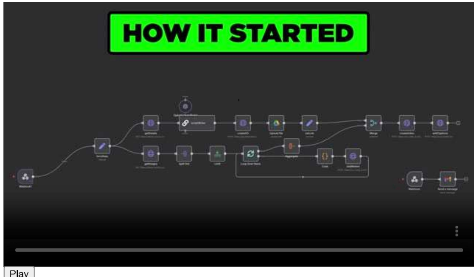

Media is loading

 Play Play

 Loaded: 26.61%

0:00

Stream Type LIVE

 Remaining time-0:15

1x

 Playback speed Playback speed

 o 0.5x

 o 0.75x

 o 1x, selected

 o 1.25x

 o 1.5x

 o 1.75x

 o 2x

 Turn closed captions on Show captions

 Unmute

 Turn fullscreen Fullscreen

Media player modal window

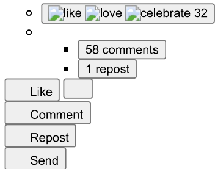

. Feed post number 200

 Rogoff· Following Following Founder@ The Build Room. Ex-Apple, PlayStation, Nissan. 7mo  $\bullet$  Edited  $\bullet$ PlayStation, Nissan._7mo  $\bullet$  Edited  $\bullet$ ⑤

We plugged Google Veo 3 into a$500 B industry.

Paste a Zillow URL  $\rightarrow$  get a$1,000 video asset in 4 minutes.

Here's what happens under the hood:

Agent pastes a Zillow link  $\rightarrow$  our parser rips every detail(price, features, photos).

GPT-4 writes a custom voiceover.

ElevenLabs narrates it.

Google Veo 3 turns static photos into cinematic motion.

Output: Auto-rendered, social-ready(9:16 and 16:9).

Delivered by email in~4 minutes.

Here's the math:

Traditional way:10 listings/month  $\rightarrow$  $500 per video  $=\$ 5,000$  /month.

Most agents skip video entirely- it's too expensive.

Result: longer listings, fewer inquiries.

The automation way:

Same 10 listings  $\rightarrow$  \  $ 49 per video \(=\ \( 490/ month$  .

Every listing gets video.

 $+403\%$  more inquiries,  $31\%$  faster sales.

The gap:$4,510 saved per month=$54,120 per year.

We're not selling AI.

We're selling time(minutes instead of days) and saving money($49 instead of$500).

Like+ Comment"REAL" for beta access.

Only available to the first 100 beta users.

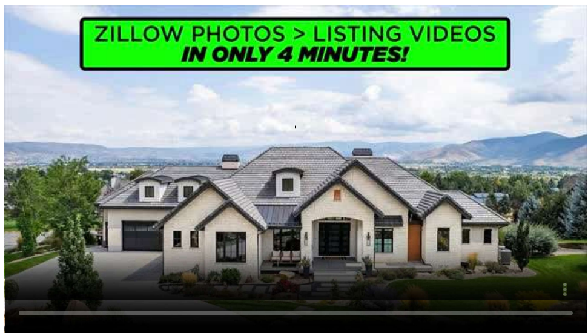

Media ing

Loaded: 50.62%

0:00

Stream Type LIVE

 Remaining time-0:08

1x

 Playback speed Playback speed

$$\begin{array}{l}{}\\ {\circ}\\ {0.5x}\\ \end{array}$$

o 0.75x

 o 1x, selected

 o 1.25x

 o 1.5x

 o 1.75x

 o 2x

 Turn closed captions on Show captions

 Unmute

 Turn fullscreen on

 Media player modal window

like love celebrate 41 o

 o

.47 comments

1 repost

post number 217

 Rogoff· Following Founder Build R om. Ex-Apple, PlayStation, Nissan.8mo• Edited•

The 30-second habit that changed everything.

It's easy to feel like you're not making progress.

Everyone else seems to be crushing it while you're stuck in the grind.

Social media doesn't help- endless highlight reels of other people's wins.

But here's what I've learned:

You're probably accomplishing way more than you realize.

The problem:

We only count the big victories.

The promotion.

The major client.

The viral post.

Meanwhile, all the real progress- the daily building blocks- goes unnoticed.

The habit:

At the end of each day, write down three things you accomplished.

Takes 30 seconds.

When you start tracking wins, you realize how much you're actually getting done.

That client email you sent.

The difficult conversation you handled.

The skill you practiced.

Suddenly, you see progress everywhere.

What counts as a win:

- Completed a challenging task you've been avoiding

- Had a breakthrough moment with a project

 Made it through a tough day with grace

 Learned something new, even something small

 Took care of yourself when you needed it

 Instead of feeling behind, you start seeing momentum.

Instead of comparing yourself to others, you focus on your own growth.

Your challenge:

Drop ONE win from this week in the comments.

Any size.

The goal isn't to impress anyone- it's to recognize what you're already doing right.

What's one thing you accomplished this week?

I'll go first in the comments

Activate to view larger image,

No alternative text description for this image

 Activate to view larger image,

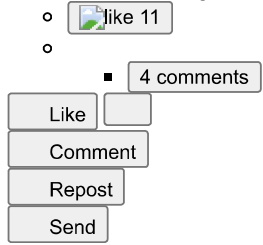

• Feed post number 218

Rogoff- Following Founder@ The Build Room. Ex-Apple, PlayStation, Nissan. 8mo•⑤

...

paying for video effects you can make for free.

Those viral costume transitions flooding your feed?

Most creators are dropping serious cash on fancy software or hiring editors.

Here's the reality:

You can create the exact same effects with three free tools.

The secret stack:

→Google's Nano Banana(transforms any photo)

→Veo3(creates smooth video transitions)

→CapCut(puts it all together)

How it actually works:

Take one photo of yourself.

Generate costume variations with AI.

Create transition videos that make you morph in real-time.

The whole process takes maybe 20 minutes.

Why this matters:

These transition hooks are getting millions of views because they stop the scroll instantly.

The visual surprise is pure engagement gold.

But everyone assumes you need technical skills or expensive tools.

Works perfectly for both YouTube(landscape) and TikTok/Instagram(vertical).

Same technique, different aspect ratios.

You can become a robot, superhero, fantasy character- whatever fits your content theme.

Ready to create viral hooks without the budget?

Comment VIRAL and I'll send you the complete step-by-step video tutorial!

Stop watching these effects thinking they're out of reach.

Start creating them yourself.

Media Media is loading

$$\text{Loaded:}\,72.29\%$$

0:00

Stream Type LIVE

 Remaining time-0:05

1x

 Playback speed Pback speed

 $\circ$  0.

0.75x

1x, selected

 o 1.

1.5x

 o 1.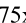x

 o 2x

 TurnShow captions

Unmute

reen on reen

 Mdia player modal window

 $\mathcal{S}$ 

 $\begin{align*}\begin{aligned}\mathcal{O}\end{aligned}$ 

103 comments

 Repost

. Feed post number 219

Duncan Rogoff- Following Founder@ The Build Room. Ex-Apple, PlayStation, Nissan. 8mo  $\bullet$ ⑤

...

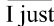just automated my LinkedIn engagement.

While everyone else manually scrolls and comments for hours, my AI does it for me.

Here's what happened:

I built an automation that finds posts from key people in my industry, writes thoughtful comments in my voice, and posts them automatically.

The result?

Consistent engagement without the time drain.

How it works:

→Scrapes posts from profiles I choose

 Analyzes each post using AI

→Writes comments using my tone of voice guidelines

→→Posts authentic responses that sound like me

→→Tracks everything in a database

The framework it follows:

-Acknowledge the original post

Add a fresh perspective or insight

Share a brief personal experience

d with a genuine question

 Why this matters:

LinkedIn engagement is crucial but time-consuming.

This automation lets you stay visible and build relationships while focusing on higher-value work.

The system runs on:

→n8n(automation platform)

→Apify(data scraping)

→Unipile(LinkedIn API)

→Airtable(data management)

The controversial part?

Some people think automated engagement isn't"authentic."

But here's the thing: The AI writes in MY voice using MY guidelines. I

 t's not generic spam- it's my thoughts, just scaled efficiently.

Ready to automate your LinkedIn presence?

Comment AUTO and I'll send you the complete video guide.

Stop spending hours manually engaging.

Let automation handle the consistency while you focus on strategy.

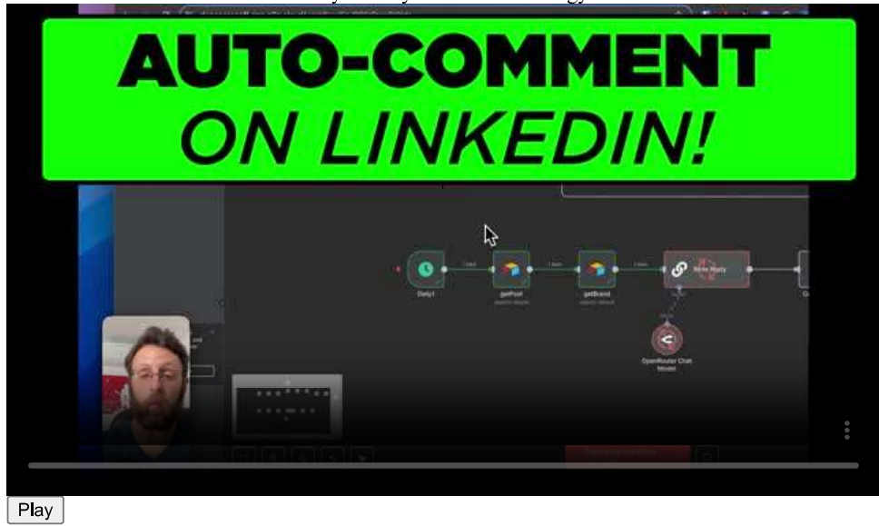

Media is loading

 Play Play

Loaded:27.40%

0:00

Stream Type LIVE

 Remaining time-0:14

1x

 Playback speed Playback speed

 o 0.5x

 o 0.75x

 o 1x, selected

 o 1.25

o 1.5x

 o 1.75x

 o 2x

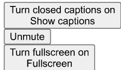

 Media player modal window

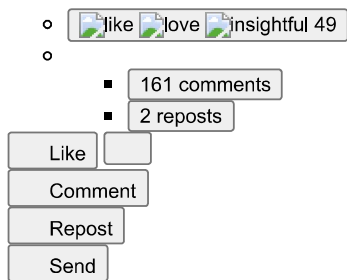

• Feed post number 220

 View

 Duncar

 Duncar Duncan Rogoff $\bullet$  Following Founder  $@$  The Build Room. Ex-Apple, PlayStation, Nissan. 8mo  $\bullet$   $\bullet$ 

 $\cdots$ 

There's an automation that's taking over every industry.

And most people have no idea what it is.

RAG knowledge bases.

Here's the reality:

Your business knowledge is scattered across Google Docs, Slack threads, email chains, and your team's heads.

When someone needs an answer, they either:

→Spend 20 minutes searching

→Ask the same question for the 50th time

→Give up and wing it

 A RAG knowledge base changes this completely.

Upload any document  $\rightarrow$  AI learns it instantly

 Drop in a YouTube video  $\rightarrow$  AI extracts the knowledge

 Ask any question  $\rightarrow$  Get the exact answer from YOUR content

 Why this matters for beginners:

This is one of the most practical AI automations you can build.

No complex workflows.

No fancy integrations.

Just pure knowledge management that every business desperately needs.

The magic happens when you realize:

- Your customer support can instantly reference any policy

- New hires can get answers without bothering the team

- You can query years of meeting notes in seconds

- Complex procedures become searchable knowledge

 Built with beginner-friendly tools:

→n8n(visual drag-and-drop)

 $\rightarrow$  Pinecone(handles the AI complexity for you)

→OpenAI(provides the intelligence)

→Google Drive(your existing files)

No coding required.

No PhD in machine learning needed.

Ready to turn your scattered knowledge into an AI assistant?

Comment"RAG" and I'll send you:

√Complete tutorial walkthrough

√Ready-to-importworkflow

√Access to a growing vault of pre-built automations

 Stop reinventing the wheel.

Start building your knowledge advantage.

Activate to view larger image,

No alternative text description for this image

 Activate to view larger image,

Like Comment Repost Send

- Feed post number 230

Rogoff-Following Founder@ The Build Room. Ex-Apple, PlayStation,  $\underline{Nissan.9mo}\cdot$ ⑤

The$0.40 hack that's killing the UGC industry.

..While everyone's paying creators hundreds per video, I built an AI system that generates authentic UGC content for pocket change.

Here's what I did:

→Found trending products using Kalodata

→Fed product images into my N8N automation workflow

→Used ChatGPT-5+ Google's Nano Banana+ Veo3 to create realistic UGC videos

→Generated content that looks like real people filmed it on their phones

 The result?

Videos like"TikTok made me buy this..." that look 100% authentic.

Most people think you need real creators for UGC.

Wrong.

My system creates:

●Casual smartphone-style footage

 $\bullet$  Real-looking actors in everyday settings(cars, mirrors, podcasts)

●Natural voiceovers with authentic scripts

●Multiple variations for testing

 Cost per video?

Just$0.40 with Veo3 Fast.

Image generation?

Completely FREE with Nano Banana.

While others spend hundreds on creators, I'm generating dozens of high-converting UGC videos daily.

The future of e-commerce content is automated.

And it's happening now.

Comment'UGC' if you want the complete workflow breakdown.

...more

 Media is loading

Loaded: 37.74%

0:00

Stream Type LIVE

 Remaining time-0:10

Playback speedPlayback speed

 o 0.5x

 o 0.75x

 o 1x, selected

 o 1.25

o 1.5x

 o 1.75x

 o 2x

 Media player modal window

• Feed post number 231

ew

uncar

 uncar can Rogoff$$\bullet\text{Following Founder@ The Build Room. Ex-Apple, PlayStation, Nissan. 9mo}\bullet$$⑤

...

950 builders joined in 7 days. Here's why.

I launched The Build Room last week. FOR FREE!

It's a community for aspiring AI agency founders stuck in tutorial hell.

The response has been insane:

Day 1:78 members

 Day 3: 245 members

 Day 5: 531 members

 Day 7:950+ members

 I've been helping people build AI agencies for a while now.

But I kept seeing the same pattern: talented people stuck in tutorial hell, consuming content but never actually building

 That didn't sit right with me.

So I decided to change that.

Inside The Build Room(completely free), members get:

Ready-to-use automation templates-n8n& Make workflows that save hours

AI Agency playbooks-Proven scripts and pricing guides

Content systems-Plug-and-play tools that attract leads

.Global founder network-Real feedback from builders worldwide

The result?

 Members are already landing their first AI automation clients.

Others are replacing lost jobs with AI agency income.

Some are finally making the career shift they've been planning.

Why it's working:

No fluff. No pitch-fests. Just builders helping builders succeed.

Ready to stop watching tutorials and start building your AI agency?

free for life, but the energy in there is priceless.

...more

 Activate to view larger image,

diagram

 Activate to view

 o

o

1,225 comments

 Like Comment

 Send

• Feed post number 232

can Rogoff.-Apple,PlayStation●

......

trying to sell$10K builds on first calls.

They pitch$5K$10K projects to strangers.

That's like proposing marriage on the first date.

High friction. Low trust. Zero conversions.

Here's what works instead:

The"Paid Discovery Build"-a$1K entry project that does 3 things:

Diagnoses their pain  $\rightarrow$  You find where they're bleeding money

Delivers a quick win→They see tangible results in days

Sets up the upsell  $\rightarrow$  The bigger project becomes inevitable

 I learned this the hard way after countless"we'll think about it" responses.

Now my clients literally ask ME for the upsell.

Why it works:

- Low risk= easy yes at$1K

-Fast results= instant credibility

- By the time you present the$10K proposal, they've already experienced ROI

 The flow:

→Sell$1K Paid Discovery Build

→Deliver outsized value in the MVP

→Present roadmap as"logical next step"

Result?

They're already convinced before you even ask.

What's been your biggest challenge when trying to close high-ticket clients on first calls?

Drop your experience below

...more。like insightful 15。

6 comments

 Like Comment

 Send

•Feed post number 233

can Rogoff- Following Founder@ The Build Room. Ex-Apple, PlayStation, Nissan. 9mo•

...

4 weeks. 2,000+ leads.

A few weeks ago, I made the decision to take one channel seriously-LinkedIn.

When I made this decision I had~2500 followers. I'm now over 5k.

Take a look at the screenshots below.

7 days. 28 days. 90 days.

You'll see the exact moment I stopped dabbling and went all in on one system: a lead magnet strategy.

The result? In just 4 weeks, 2,000+ people raised their hand and said:

"I'm INTERESTED in what you're doing."

The shift wasn't luck. It was focus.

When you commit to one strategy and execute it fully, growth compounds fast.

That's the purpose of The Build Room community- to give you the clarity, systems, and support so you can create your own"inflection point" moment.

After you check the screenshots:

Like+ Comment"BUILD" below for FREE instant access to The Build Room.

P.S. Takes 30 seconds to join. Comment'BUILD' and I'll send everything

...more

. Feed post number 234

Rogoff.- Following Founder@ The Build Room. Ex-Apple, PlayStation, Nissan. 9mo- Edited-

- Following Founder@ The Build Room. Ex-Apple, PlayStation, Nissan. 9mo- Edited-

99% of AI agencies are too99% of AI agencies are too slow.

This single automation is personally responsible for thousands in client revenue.

Here's what it does:

The moment someone fills out my contact form:

→AI summarizes their request in 2-10 words

→Sends a personal"we got it" email in 3 minutes

→Analyzes their budget and needs

→Sends a custom follow-up 12 minutes later

 For qualified leads($10K+ budget):

The system books them straight onto my calendar with a personalized message about their specific needs.

For smaller budgets:

My AI agent analyzes their request and creates custom responses:

●Packages they can afford

●Down-sell offers like$997 business audits

.Community invites for out-of-scope requests

 The best part? I literally do nothing.

While my competitors manually respond to inquiries hours later, my system:

√Responds faster than humanly possible

√Never forgets to follow up

√Qualifies leads automatically

√Createsurgency("our calendarfillsfast")

The psychology is brilliant:

First email feels personal→ Creates anticipation→ Second email delivers the perfect solution

 Speed wins in client acquisition.

The faster you respond, the more likely you close.

This system has completely transformed my business.

No more missed opportunities, no more manual qualifying, no more late responses losing deals.

Want to see exactly how I built this client-booking machine?

I've recorded a complete walkthrough showing:

- The exact automation workflow

-Email templates that convert

-AI prompts for lead qualification

- Integration setup step-by-step

 Comment"AUTOMATION" and I'll send you the free video guide.

...more

is loading

Loaded: 43.01%

Type LIVE

$$\text{maining time}-0:09$$

1x

o 0.75x

cted

1.25x

1.5x

 o 1.75x

2x

 Turn closed captions on Show captions

Turn fullscreen on

 Media player modal window

like love support 119 $\circ$ 

.280 comments

$$\begin{align*}&=\sum_{i=1}^{n}\sum_{$$4 reposts

 Like Comment

 Repost

• Feed post number 235

 View Duncar

 Duncar Duncan Rogoff.Followin Following Founder@ The Build Room. Ex-Apple, PlayStation, Nissan. 9mo•

$$\cdots\\ [$$

utomationoffer is why you're not getting clients.

Most AI agencies fail because they're selling tasks, not outcomes.

"I build automations""I build automations"

"I build automations"

"I can help with AI tools

Clients don't buy tasks. They buy results.

Here's what changed everything for me...

I spent 4 months pitching"automation services" and got ghosted by 47 prospects.

Then I discovered Alex Hormozi's Grand Slam Offer framework and rebuilt my entire approach.

The difference? Instead of selling what I do, I started selling what they get.

HORMOZI'S GRAND SLAM FORMULA:

Dream Outcome→ What they want most(specific+ measurable)

Perceived Likelihood→Make success feel guaranteed

Time Delay How fast they see results

Effort Required→What they have to do(minimize this)

THE TRANSFORMATION:

BEFORE(weak offer):

"I build AI automations for coaches"

AFTER(Grand Slam):

"I help coaches book 10+ qualified calls per month in 14 days, without cold calling, using our Done-For-You AI Lead Nurture System. If you don't see new calls in 30 days, you don't pay."

THE RESULTS:

Next 30 days after switching:

√ 23 qualified conversations

8 discovery calls booked

5 clients signed($31,500 total)

Zero price objections

 THE FRAMEWORK IN ACTION:

Fill in this formula:

"I help[WHO] achieve[DREAM OUTCOME] in[TIMEFRAME], without[BIG SACRIFICE], using[YOUR SYSTEM]. We guarantee[PROOF/RESULT]."

Examples that convert:

"Turn 1 video into 10 pieces of content across all platforms-automatically posted every week, without lifting a finger"

"Book 5 extra client calls per month using AI lead qualification-live in 7 days, or we work for free"

What's your current offer?

Drop it in the comments and I'll show you how to transform it using this framework.

P.S. Stop selling what you do. Start selling what they get.

 $\ldots$  more

 Activate to view larger image,

text

 text

 file:///G:/My Drive/LinkedIn Content Creators Pages to Study/Post_Activity_Duncan Rogoff_LinkedIn.htm

